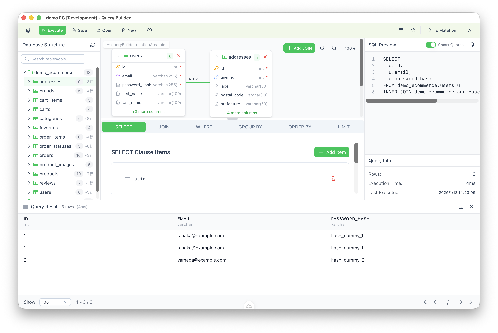

# SQL Query Builder

A visual SQL query builder desktop application that lets you construct queries through an intuitive drag-and-drop interface.

[日本語](README.md) | English

## Why SQL Query Builder?

- **Visual Query Construction**: Build SQL queries by dragging tables and selecting columns - no need to memorize syntax
- **Environment Safety**: Color-coded windows prevent accidental queries on production databases
- **Real-time SQL Preview**: See the generated SQL as you build your query
- **Multi-Database Support**: Works with PostgreSQL, MySQL, and SQLite
- **SQL Editor**: Monaco Editor-based free-form SQL editing and execution with code completion and multi-tab support
- **Secure Credential Storage**: Your database passwords are encrypted locally



## Features

### Connection Management

- Save and organize multiple database connections
- Environment classification (Development / Test / Staging / Production)
- Connection testing before saving
- Custom color themes per connection

### Visual Query Builder (SELECT)

- Drag & drop table selection from database tree
- Column selection with aliases
- JOIN support (INNER / LEFT / RIGHT / FULL OUTER) with foreign key suggestions
- WHERE conditions with nested groups (AND/OR)
- GROUP BY with aggregate functions (COUNT, SUM, AVG, MAX, MIN)
- ORDER BY (ASC/DESC, multiple columns)
- LIMIT/OFFSET support
- Subquery support in SELECT clause
- Real-time SQL generation with syntax highlighting

### SQL Editor

- Free-form SQL editor powered by Monaco Editor
- Multi-tab support (edit multiple SQL queries simultaneously)
- Code completion for table names, column names, and SQL keywords
- SQL formatter (auto-formatting)
- Execute selected text only
- Saved query management with folder organization
- Searchable execution history
- Keyboard shortcuts (Ctrl+Enter to execute, Ctrl+S to save)

### Data Mutation Builder (INSERT/UPDATE/DELETE)

- Visual INSERT row builder
- UPDATE with SET clause and WHERE conditions
- DELETE with WHERE conditions
- Dangerous query warnings for production environments

### Query Execution

- Execute queries directly against your database
- Result display with pagination
- Export results to CSV
- Query execution time display
- Error handling with detailed messages

### Query Management

- Save queries for later use
- Query history with search
- Query validation before execution

### Security

- AES-256-GCM encryption for credentials
- Multiple security providers:
  - Simple (app-managed key)
  - Master Password (user-defined password)
- All data stored locally - no cloud dependency

### Multi-Window Support

- Open multiple database connections simultaneously
- Each window color-coded by environment
- Production environment warnings
- Window state persistence (size/position)

### Safety Features

- Environment-specific safety settings
- Dangerous query detection (DELETE/UPDATE without WHERE)
- Confirmation dialogs for destructive operations
- Production environment warnings and banners

## Supported Platforms

| Platform | Status |
|----------|--------|
| macOS (Apple Silicon / Intel) | Supported |
| Windows 10/11 | Supported |
| Linux (Ubuntu 20.04+) | Supported |

## Supported Databases

| Database | Version |
|----------|---------|
| PostgreSQL | 12.x+ |
| MySQL | 8.0+ |
| SQLite | 3.x |

## Installation

Download the appropriate file for your operating system from the [Releases](https://github.com/sakamotchi/sql-query-build/releases) page.

### Download Guide

| OS | File | Description |
|----|------|-------------|
| **Windows** | `sql-query-build_x.x.x_x64-setup.exe` | Windows installer (recommended) |
| **Windows** | `sql-query-build_x.x.x_x64_en-US.msi` | Windows MSI installer |
| **macOS (Apple Silicon)** | `sql-query-build_x.x.x_aarch64.dmg` | For M1/M2/M3/M4 Macs |
| **macOS (Intel)** | `sql-query-build_x.x.x_x64.dmg` | For Intel Macs |
| **Linux (Ubuntu/Debian)** | `sql-query-build_x.x.x_amd64.deb` | .deb package |
| **Linux (Fedora/RHEL)** | `sql-query-build-x.x.x-1.x86_64.rpm` | .rpm package |
| **Linux (Other)** | `sql-query-build_x.x.x_amd64.AppImage` | AppImage (no installation required) |

*`x.x.x` represents the version number. Download the latest version.*

> **Note**: Currently, platforms other than macOS (Windows, Linux) have not been tested. If you encounter any issues, please report them on [Issues](https://github.com/sakamotchi/sql-query-build/issues).

#### Which macOS version should I download?

- **Macs from 2020 or later** (with M1/M2/M3/M4 chip) → `aarch64.dmg`
- **Macs before 2020** (with Intel chip) → `x64.dmg`
- If unsure: Apple menu → "About This Mac" → Check the Chip field

### Build from Source

#### Prerequisites

- Node.js v18+
- Rust (latest stable)
- Platform-specific dependencies ([Tauri Prerequisites](https://tauri.app/start/prerequisites/))

#### Steps

```bash
# Clone the repository
git clone https://github.com/sakamotchi/sql-query-build.git
cd sql-query-build

# Install dependencies
npm install

# Build the application
npm run tauri:build
```

The built application will be in `src-tauri/target/release/bundle/`.

## Development

```bash
# Start the development server
npm run tauri:dev

# Run tests
npm run test:run
cargo test --manifest-path=src-tauri/Cargo.toml

# Type check
npm run typecheck
```

### Tech Stack

- **Frontend**: Nuxt 4 + Vue 3 + TypeScript
- **UI**: Nuxt UI v4 (Tailwind CSS 4)
- **State**: Pinia
- **Desktop**: Tauri 2.x (Rust)
- **Build**: Vite 6

## License

This project is licensed under the [MIT License](LICENSE).

## Author

**Yoshitaka Sakamoto** - [@sakamotchi](https://github.com/sakamotchi)
