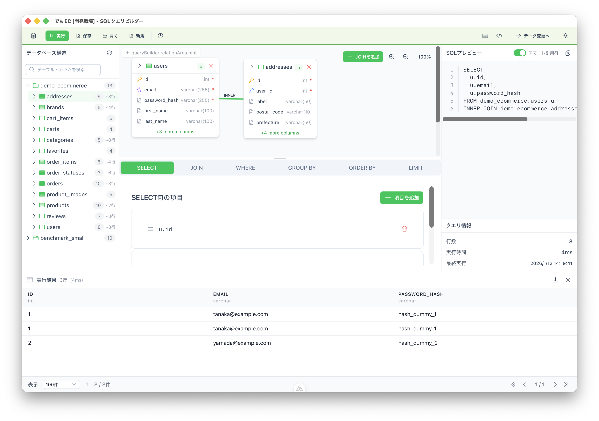

# SQL Query Builder

ドラッグ&ドロップで直感的にSQLクエリを構築できるデスクトップアプリケーション

日本語 | [English](README.en.md)

## SQL Query Builderの特徴

- **ビジュアルなクエリ構築**: テーブルをドラッグ&ドロップ、カラムを選択するだけ。SQL構文を覚える必要なし
- **環境の安全性**: ウィンドウの色分けで本番環境への誤操作を防止
- **リアルタイムSQLプレビュー**: 構築中のクエリをリアルタイムで確認
- **マルチデータベース対応**: PostgreSQL、MySQL、SQLiteをサポート
- **SQLエディタ**: Monaco EditorベースのフリーフォームSQL入力・実行（コード補完・マルチタブ対応）
- **安全な認証情報管理**: データベースパスワードはローカルで暗号化保存



## 機能

### 接続管理

- 複数のデータベース接続を保存・管理
- 環境分類（開発 / テスト / ステージング / 本番）
- 保存前の接続テスト
- 接続ごとのカスタムカラーテーマ

### ビジュアルクエリビルダー（SELECT）

- データベースツリーからドラッグ&ドロップでテーブル選択
- エイリアス付きカラム選択
- JOIN対応（INNER / LEFT / RIGHT / FULL OUTER）外部キー自動提案付き
- WHERE条件（ネストしたAND/ORグループ対応）
- GROUP BY（集計関数：COUNT, SUM, AVG, MAX, MIN対応）
- ORDER BY（ASC/DESC、複数カラム対応）
- LIMIT/OFFSET対応
- SELECT句でのサブクエリ対応
- シンタックスハイライト付きリアルタイムSQL生成

### SQLエディタ

- Monaco Editorベースのフリーフォームエディタ
- マルチタブ対応（複数のSQLを同時に編集）
- テーブル名・カラム名・SQLキーワードのコード補完
- SQLフォーマッター（自動整形）
- 選択範囲のみの実行
- フォルダ構造での保存クエリ管理
- 実行履歴の検索・再利用
- キーボードショートカット（Ctrl+Enter で実行、Ctrl+S で保存）

### データ変更ビルダー（INSERT/UPDATE/DELETE）

- ビジュアルなINSERT行ビルダー
- SET句とWHERE条件付きUPDATE
- WHERE条件付きDELETE
- 本番環境での危険なクエリ警告

### クエリ実行

- データベースへの直接クエリ実行
- ページネーション付き結果表示
- CSV形式での結果エクスポート
- クエリ実行時間表示
- 詳細なエラーメッセージ

### クエリ管理

- クエリの保存・再利用
- 検索可能なクエリ履歴
- 実行前のクエリバリデーション

### セキュリティ

- AES-256-GCMによる認証情報の暗号化
- 複数のセキュリティプロバイダー：
  - Simple（アプリ管理キー）
  - マスターパスワード（ユーザー定義パスワード）
- 全データはローカル保存（クラウド依存なし）

### マルチウィンドウ対応

- 複数のデータベース接続を同時に開く
- 環境ごとに色分けされたウィンドウ
- 本番環境での警告表示
- ウィンドウ状態の永続化（サイズ/位置）

### 安全機能

- 環境別の安全設定
- 危険なクエリの検出（WHERE句なしのDELETE/UPDATE）
- 破壊的操作の確認ダイアログ
- 本番環境の警告バナー

## 対応プラットフォーム

| プラットフォーム | 状態 |
|----------------|------|
| macOS (Apple Silicon / Intel) | 対応 |
| Windows 10/11 | 対応 |
| Linux (Ubuntu 20.04+) | 対応 |

## 対応データベース

| データベース | バージョン |
|------------|-----------|
| PostgreSQL | 12.x以降 |
| MySQL | 8.0以降 |
| SQLite | 3.x |

## インストール

[Releases](https://github.com/sakamotchi/sql-query-build/releases)ページから、お使いのOSに合ったファイルをダウンロードしてください。

### ダウンロードガイド

| OS | ファイル | 説明 |
|----|---------|------|
| **Windows** | `sql-query-build_x.x.x_x64-setup.exe` | Windowsインストーラー（推奨） |
| **Windows** | `sql-query-build_x.x.x_x64_en-US.msi` | Windows MSIインストーラー |
| **macOS (Apple Silicon)** | `sql-query-build_x.x.x_aarch64.dmg` | M1/M2/M3/M4 Mac用 |
| **macOS (Intel)** | `sql-query-build_x.x.x_x64.dmg` | Intel Mac用 |
| **Linux (Ubuntu/Debian)** | `sql-query-build_x.x.x_amd64.deb` | .debパッケージ |
| **Linux (Fedora/RHEL)** | `sql-query-build-x.x.x-1.x86_64.rpm` | .rpmパッケージ |
| **Linux (その他)** | `sql-query-build_x.x.x_amd64.AppImage` | AppImage（インストール不要） |

※ `x.x.x` はバージョン番号です。最新版をダウンロードしてください。

> **注意**: 現在、macOS以外のプラットフォーム（Windows、Linux）では動作確認を行っていません。問題が発生した場合は[Issues](https://github.com/sakamotchi/sql-query-build/issues)でご報告ください。

#### どのmacOS版をダウンロードすべき？

- **2020年以降のMac**（M1/M2/M3/M4チップ搭載）→ `aarch64.dmg`
- **2020年以前のMac**（Intelチップ搭載）→ `x64.dmg`
- 不明な場合：Appleメニュー →「このMacについて」→ チップの項目を確認

### ソースからビルド

#### 前提条件

- Node.js v18以上
- Rust（最新安定版）
- プラットフォーム固有の依存関係（[Tauri Prerequisites](https://tauri.app/start/prerequisites/)）

#### 手順

```bash
# リポジトリをクローン
git clone https://github.com/sakamotchi/sql-query-build.git
cd sql-query-build

# 依存関係をインストール
npm install

# アプリケーションをビルド
npm run tauri:build
```

ビルドされたアプリケーションは `src-tauri/target/release/bundle/` に出力されます。

## 開発

```bash
# 開発サーバーを起動
npm run tauri:dev

# テストを実行
npm run test:run
cargo test --manifest-path=src-tauri/Cargo.toml

# 型チェック
npm run typecheck
```

### 技術スタック

- **フロントエンド**: Nuxt 4 + Vue 3 + TypeScript
- **UI**: Nuxt UI v4 (Tailwind CSS 4)
- **状態管理**: Pinia
- **デスクトップ**: Tauri 2.x (Rust)
- **ビルド**: Vite 6

## ライセンス

このプロジェクトは[MITライセンス](LICENSE)の下で公開されています。

## 作者

**Yoshitaka Sakamoto** - [@sakamotchi](https://github.com/sakamotchi)
