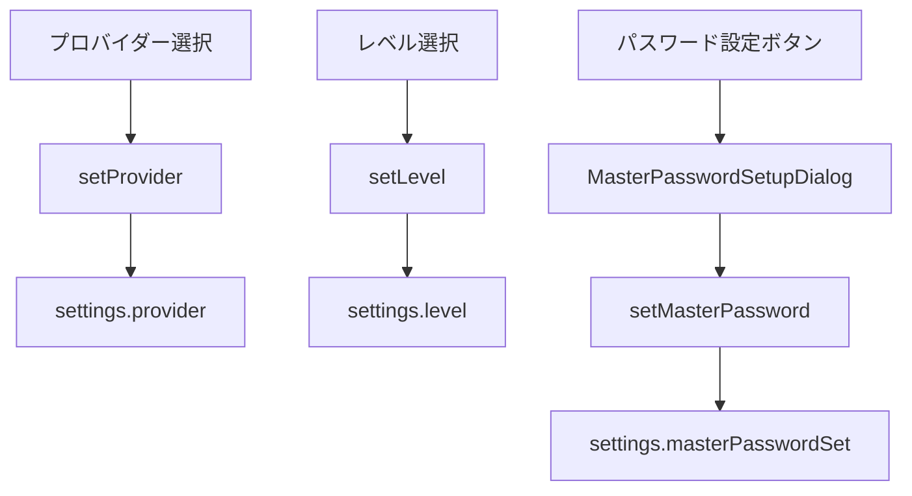

# 3.1.3 SecuritySettings.vue

**フェーズ**: 1.5b Phase 3 - サブフェーズ3.1
**作成日**: 2025-12-12
**工数**: 0.75日

---

## 目的

セキュリティ設定（プロバイダー選択、レベル設定）のUI実装

---

## 実装内容

### ファイル構成

**`app/components/settings/SecuritySettings.vue`**

---

### コンポーネント仕様

- セキュリティプロバイダーとセキュリティレベルを編集するカードを提供
- プロバイダーが `master-password` の場合のみマスターパスワード設定セクションを表示
- ストアの `loading` / `error` を利用してローディング・エラー表示を行う
- マスターパスワード設定/変更は `MasterPasswordSetupDialog` を表示し、完了後 `masterPasswordSet` を更新する

### 実装コード

```vue
<script setup lang="ts">
import { storeToRefs } from 'pinia'
import type { SecurityLevel, SecurityProvider } from '~/types'

const securityStore = useSecurityStore()
const { settings, loading, error } = storeToRefs(securityStore)

const showMasterPasswordDialog = ref(false)
const providerOptions: { label: string; value: SecurityProvider; description: string }[] = [
  { label: 'OSキーチェーン', value: 'system', description: 'OSの安全なストレージに保存' },
  { label: 'マスターパスワード', value: 'master-password', description: 'アプリ内で暗号化を管理' }
]

const levelOptions: { label: string; value: SecurityLevel; hint: string }[] = [
  { label: '低', value: 'low', hint: '基本的な暗号化' },
  { label: '中', value: 'medium', hint: '推奨設定' },
  { label: '高', value: 'high', hint: '最も厳格な設定' }
]

const saving = ref(false)
const message = ref<string | null>(null)

const updateProvider = async (provider: SecurityProvider) => {
  saving.value = true
  message.value = null
  try {
    await securityStore.setProvider(provider)
    message.value = 'プロバイダーを更新しました'
  } catch (e) {
    message.value = 'プロバイダーの更新に失敗しました'
  } finally {
    saving.value = false
  }
}

const updateLevel = async (level: SecurityLevel) => {
  saving.value = true
  message.value = null
  try {
    await securityStore.setLevel(level)
    message.value = 'セキュリティレベルを更新しました'
  } catch (e) {
    message.value = 'セキュリティレベルの更新に失敗しました'
  } finally {
    saving.value = false
  }
}

const openMasterPasswordDialog = () => {
  showMasterPasswordDialog.value = true
}
</script>

<template>
  <div class="space-y-6">
    <UCard>
      <template #header>
        <div class="flex items-center justify-between gap-3">
          <h3 class="text-xl font-semibold">セキュリティプロバイダー</h3>
          <UBadge v-if="saving" color="primary" variant="soft">保存中</UBadge>
        </div>
      </template>

      <div class="space-y-4">
        <UFormGroup label="プロバイダー" hint="保存先と復号方式を選択します">
          <USelect
            :model-value="settings.provider"
            :options="providerOptions"
            option-attribute="label"
            value-attribute="value"
            @update:model-value="updateProvider"
          >
            <template #option="{ option }">
              <div class="flex flex-col">
                <span class="font-medium">{{ option.label }}</span>
                <span class="text-xs text-gray-500">{{ option.description }}</span>
              </div>
            </template>
          </USelect>
        </UFormGroup>

        <UFormGroup label="セキュリティレベル" hint="暗号化強度を選択します">
          <URadioGroup
            :model-value="settings.level"
            :options="levelOptions"
            value-attribute="value"
            @update:model-value="updateLevel"
          >
            <template #label="{ option }">
              <div class="flex items-center justify-between w-full">
                <span>{{ option.label }}</span>
                <span class="text-xs text-gray-500">{{ option.hint }}</span>
              </div>
            </template>
          </URadioGroup>
        </UFormGroup>

        <UAlert
          v-if="error || message"
          :color="error ? 'red' : 'green'"
          variant="soft"
          :title="error ? '設定の読み込み/保存でエラーが発生しました' : '完了'"
        >
          {{ error || message }}
        </UAlert>
      </div>
    </UCard>

    <UCard v-if="settings.provider === 'master-password'">
      <template #header>
        <h3 class="text-xl font-semibold">マスターパスワード</h3>
      </template>

      <div class="space-y-4">
        <div class="flex items-center justify-between">
          <div>
            <p class="text-sm text-gray-600 dark:text-gray-400">接続情報を暗号化します</p>
            <p class="text-xs text-gray-500">
              設定済み: {{ settings.masterPasswordSet ? 'はい' : 'いいえ' }}
            </p>
          </div>
          <UButton
            :variant="settings.masterPasswordSet ? 'outline' : 'solid'"
            @click="openMasterPasswordDialog"
          >
            {{ settings.masterPasswordSet ? '変更する' : '設定する' }}
          </UButton>
        </div>
      </div>
    </UCard>

    <MasterPasswordSetupDialog v-model="showMasterPasswordDialog" />
  </div>
</template>
```

---

## 技術仕様

### セキュリティプロバイダー

| プロバイダー | 値 | 説明 |
|------------|---|------|
| OSキーチェーン | 'system' | OSの安全なストレージを利用 |
| マスターパスワード | 'master-password' | アプリ内でユーザー指定パスワードにより暗号化 |

### セキュリティレベル

| レベル | 値 | 説明 |
|-------|---|------|
| 低 | 'low' | 基本的な暗号化 |
| 中 | 'medium' | 推奨レベル |
| 高 | 'high' | 最も厳格な設定 |

### 使用コンポーネント

- `UCard` / `UFormGroup` / `USelect` / `URadioGroup` / `UButton` / `UBadge` / `UAlert`
- `MasterPasswordSetupDialog`（3.2.1で実装、`v-model`で開閉）

### 使用Composable / ストア

- `useSecurityStore()`  
  - `settings`: `{ provider, level, masterPasswordSet }`  
  - `setProvider(provider: SecurityProvider)`  
  - `setLevel(level: SecurityLevel)`  
  - `setMasterPassword(password: string)`（ダイアログから呼び出し）  
  - `loading` / `error`

### データフロー



---

## 成果物

- [ ] `app/components/settings/SecuritySettings.vue`

---

## 動作確認項目

- [ ] プロバイダーを切り替えるとストアが更新され、メッセージが表示される
- [ ] セキュリティレベルを変更できる（low/medium/high）
- [ ] プロバイダーが`master-password`のときだけマスターパスワード設定セクションが表示される
- [ ] マスターパスワード設定/変更ボタンでダイアログが開く
- [ ] ストアのエラーがアラートで表示される

---

## 依存関係

**前提条件**:
- ✅ `useSecurityStore()` が実装され、`get_security_settings` / `set_security_provider` / `set_security_level` / `set_master_password` が利用可能
- ✅ `MasterPasswordSetupDialog` が3.2.1で実装される
- ✅ Nuxt UIコンポーネント（USelect/URadioGroup/UAlert等）が利用可能

**次のステップ**:
- 3.2.1 MasterPasswordSetupDialog.vueの実装
- セキュリティ要件に応じたレベル説明文の詳細化（Phase 4以降）

---

## 備考

- プロバイダー切替とレベル変更は即時反映・即保存とし、保存ボタンを設けないシンプルな操作性を優先
- ストアの `loading` はページ全体（settings.vue）側で扱う想定のため、ここではボタン無効化ではなく処理中バッジで可視化

**関連コンポーネント**:
- `SecurityProviderCard.vue` - 同時に実装
- `SecurityLevelIndicator.vue` - 同時に実装
- `ProviderChangeDialog.vue` - 同時に実装

---

## セキュリティ考慮事項

### パスワード保護

- マスターパスワードは平文でログやストレージに書き出さない（Tauri側で即ハッシュ化・暗号化）
- ダイアログ閉鎖時に入力値をクリアし、クリップボードコピーは行わない
- エラー表示は一般化し、具体的な理由はログ側でのみ把握する

### プロバイダー変更

- プロバイダー変更時は既存データの再暗号化が必要なため、バックエンド側で安全に移行処理を行う
- 変更前に確認ダイアログでリスクを告知し、ユーザー操作を要求する（Phase 3.2以降で導入）
- 失敗時はロールバックし、現在のプロバイダー状態を維持する

---

## 今後の拡張

### Phase 2以降で追加予定

- 生体認証（Touch ID/Face ID/Windows Hello）
- セッションタイムアウト設定
- 自動ロック機能
- パスワード履歴管理
- 2要素認証

---

## 備考

- セキュリティレベルはユーザー操作で選択し、バックエンドは選択に応じた暗号化強度を適用する
- プロバイダー変更は慎重に行う必要があるため、確認ダイアログ（Phase 3.2以降）で明示する
- OSキーチェーンは各OS固有のAPIを使用するため、プラットフォーム差分はTauri側で吸収する
