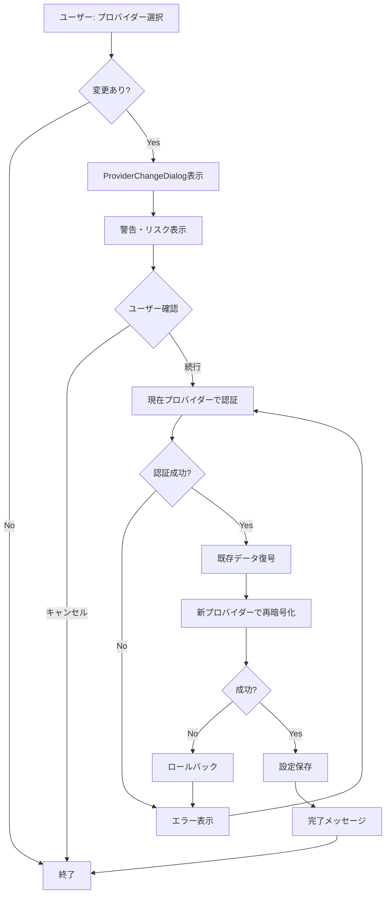
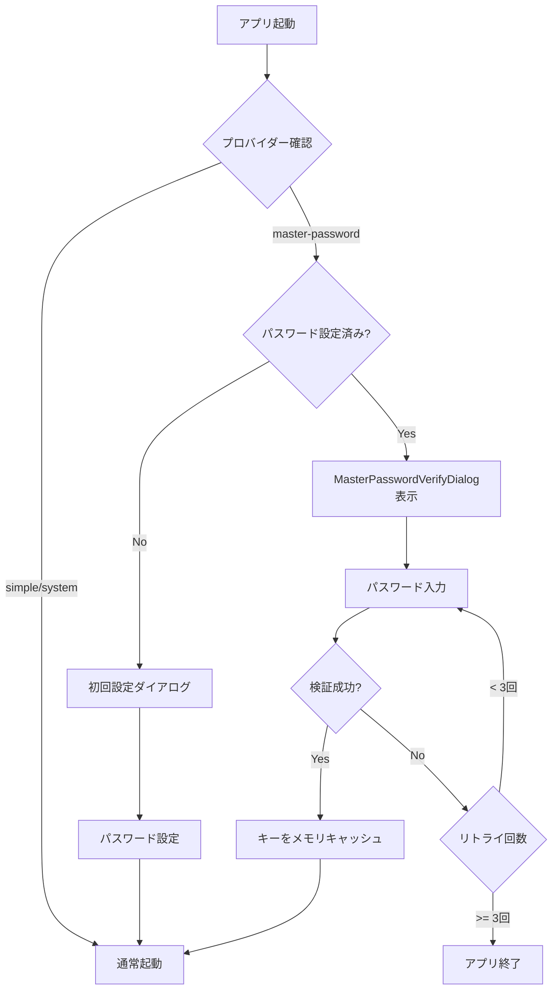

# 3.2.2 セキュリティ機能ギャップ分析と実装計画

**フェーズ**: 1.5b Phase 3 - サブフェーズ3.2
**作成日**: 2025-12-14
**工数**: 調査・計画 0.5日

---

## 目的

要件定義書「3.5 セキュリティプロバイダー要件」と現状実装（3.1.3/3.2.1）のギャップを分析し、不足機能の実装計画を立案する。

---

## 現状実装の整理

### 実装済み機能 ✅

| 機能 | 実装状況 | ファイル |
|------|---------|---------|
| セキュリティプロバイダー選択UI | ✅ | `SecuritySettings.vue` |
| セキュリティレベル選択UI | ✅ | `SecuritySettings.vue` |
| マスターパスワード設定ダイアログ | ✅ | `MasterPasswordSetupDialog.vue` |
| パスワード強度メーター | ✅ | `PasswordStrengthMeter.vue` |
| パスワード要件チェック | ✅ | `PasswordRequirements.vue` |
| ストア（基本機能） | ✅ | `stores/security.ts` |

**プロバイダー対応状況**:

| プロバイダー | バックエンド | フロントエンド | 型定義 |
|------------|------------|--------------|--------|
| Simple (デフォルト) | ✅ | ❌ | ❌ |
| MasterPassword | ✅ | ✅ | ✅ |
| Keychain (OSキーチェーン) | ✅ | ✅ (UIでは`system`) | ✅ (型は`system`) |

**問題点**:
- バックエンドには3つのプロバイダーすべて実装済み（`Simple`, `MasterPassword`, `Keychain`）
- フロントエンド型定義は2つのみ（`'system'`, `'master-password'`）で、`'simple'`が存在しない
- フロントエンドとバックエンドの型名が不一致（`system` vs `Keychain`）

---

## ギャップ分析

### 1. **優先度: 高（必須）**

#### 1.1 Simpleプロバイダーの追加（フロントエンド統合）
- **要件**: 3つのプロバイダー（Simple/Master Password/OS Keychain）
- **現状**: バックエンドは実装済み、フロントエンドは2つのみ（system/master-password）
- **影響**: デフォルトプロバイダーが選択できない、初回起動時にパスワード設定を強制される可能性
- **実装**:
  - `SecurityProvider`型に`'simple'`を追加
  - `SecuritySettings.vue`のUIに選択肢追加
  - ストアに対応追加
  - **型名の統一**: フロントエンド`'system'` → `'keychain'`に変更してバックエンドと一致させる

#### 1.2 プロバイダー変更時の確認ダイアログ
- **要件**: プロバイダー変更時に既存認証情報を再暗号化、変更前に確認
- **現状**: 直接変更されてしまう
- **影響**: データ損失・セキュリティリスク
- **実装**: `ProviderChangeDialog.vue`（確認→現在認証→再暗号化）

#### 1.3 マスターパスワード起動時検証ダイアログ
- **要件**: マスターパスワードプロバイダー使用時、起動時に1回入力
- **現状**: 未実装
- **影響**: 暗号化データにアクセスできない
- **実装**: `MasterPasswordVerifyDialog.vue`（起動時表示、リトライ機能）

#### 1.4 マスターパスワード変更機能
- **要件**: 現在パスワード確認→新規パスワード設定
- **現状**: 設定のみ、変更は未対応
- **影響**: パスワード更新不可
- **実装**: `MasterPasswordSetupDialog.vue`にモード追加（setup/change）

---

### 2. **優先度: 中（重要）**

#### 2.1 セキュリティ設定の詳細情報表示
- **要件**: 各プロバイダーの特徴・利点・欠点を明示
- **現状**: 簡易説明のみ
- **影響**: ユーザーが適切なプロバイダーを選択できない
- **実装**: `SecurityProviderInfo.vue`（詳細説明カード、比較表）

#### 2.2 セキュリティレベル詳細説明
- **要件**: 各レベルの暗号化仕様を明示
- **現状**: 「基本的な暗号化」等の抽象的説明のみ
- **影響**: レベルの違いが不明確
- **実装**: `SecurityLevelInfo.vue`（仕様詳細、推奨用途）

#### 2.3 セッションタイムアウト設定
- **要件**: メモリ内キーキャッシュのタイムアウト
- **現状**: 未実装（キーがメモリに永続？）
- **影響**: セキュリティリスク
- **実装**: `SessionTimeoutSettings.vue`（タイムアウト時間設定、自動ロック）

#### 2.4 データエクスポート/インポート
- **要件**: プロバイダー変更時のデータ移行
- **現状**: 未実装
- **影響**: データ移行・バックアップ不可
- **実装**: `SecurityDataManagement.vue`（エクスポート・インポート・バックアップ）

---

### 3. **優先度: 低（将来拡張）**

#### 3.1 監査ログ・操作履歴
- **要件**: セキュリティ操作の記録
- **現状**: 未実装
- **影響**: セキュリティインシデント時の追跡不可
- **実装**: Phase 2以降で検討

#### 3.2 生体認証
- **要件**: Touch ID/Face ID/Windows Hello
- **現状**: 未実装
- **影響**: UX向上の機会損失
- **実装**: Phase 2以降で検討

#### 3.3 2要素認証
- **要件**: 追加の認証レイヤー
- **現状**: 未実装
- **影響**: 最高レベルのセキュリティ未達
- **実装**: Phase 3以降で検討

#### 3.4 パスワード履歴管理
- **要件**: パスワード再利用防止
- **現状**: 未実装
- **影響**: セキュリティポリシー適用不可
- **実装**: Phase 2以降で検討

---

## 実装優先順位

### Phase 1（緊急・必須）- 工数: 3-4日

**目標**: 要件定義書の必須機能を満たす

1. **Simpleプロバイダー追加** (0.5日)
   - 型定義、UI、ストア、バックエンド対応

2. **マスターパスワード起動時検証ダイアログ** (1日)
   - `MasterPasswordVerifyDialog.vue`
   - アプリ起動フローに統合

3. **プロバイダー変更確認ダイアログ** (1日)
   - `ProviderChangeDialog.vue`
   - 再暗号化フロー

4. **マスターパスワード変更機能** (0.75日)
   - `MasterPasswordSetupDialog.vue`拡張
   - 現在パスワード検証

5. **セキュリティ情報表示強化** (0.5日)
   - プロバイダー比較表
   - レベル詳細説明

---

### Phase 2（重要）- 工数: 2-3日

**目標**: セキュリティ機能の完成度向上

1. **セッションタイムアウト設定** (1日)
   - タイムアウト時間設定UI
   - 自動ロック機能

2. **データエクスポート/インポート** (1.5日)
   - エクスポート機能
   - インポート機能
   - バックアップ・復元

3. **監査ログ基盤** (0.5日)
   - ログ記録の基礎実装
   - ログ表示UI（簡易版）

---

### Phase 3（将来拡張）- Phase 2以降で検討

1. 生体認証
2. 2要素認証
3. パスワード履歴管理
4. セキュリティポリシーエンジン

---

## 実装計画詳細

### Phase 1 詳細設計

#### 1. Simpleプロバイダー追加（フロントエンド統合）
**ファイル**: `3.2.3_simple_provider_integration.md`

- 型定義に`'simple'`追加
- UI選択肢に追加（デフォルトとして表示、初心者向けに推奨）
- 型名統一: `'system'` → `'keychain'`に変更
- バックエンドは既に実装済み（`SimpleProvider`）なので、フロントエンド側の統合のみ
- コマンド統合: `get_available_providers`, `initialize_master_password`等の既存コマンドを利用

#### 2. マスターパスワード起動時検証ダイアログ
**ファイル**: `3.2.4_master_password_verify_dialog.md`

- コンポーネント: `MasterPasswordVerifyDialog.vue`
- 機能:
  - パスワード入力フォーム
  - リトライ機能（3回まで）
  - エラー表示
  - パスワード忘れた場合のガイダンス
- 起動フロー: `app.vue`で条件分岐
  - プロバイダーが`master-password`かつ`masterPasswordSet=true`の場合に表示

#### 3. プロバイダー変更確認ダイアログ
**ファイル**: `3.2.5_provider_change_dialog.md`

- コンポーネント: `ProviderChangeDialog.vue`
- 機能:
  - 変更内容の確認（現在→新規）
  - リスク警告表示
  - 現在プロバイダーでの認証
  - 再暗号化進捗表示
  - ロールバック処理
- 呼び出し元: `SecuritySettings.vue`の`updateProvider()`

#### 4. マスターパスワード変更機能
**ファイル**: `3.2.6_master_password_change.md`

- コンポーネント: `MasterPasswordSetupDialog.vue`拡張
- 機能追加:
  - モード追加（`mode: 'setup' | 'change'`）
  - 現在パスワード入力フィールド（changeモード時）
  - 現在パスワード検証
  - 変更後の再暗号化
- ストア追加: `changeMasterPassword(oldPassword, newPassword)`

#### 5. セキュリティ情報表示強化
**ファイル**: `3.2.7_security_info_display.md`

- コンポーネント:
  - `SecurityProviderComparison.vue`（プロバイダー比較表）
  - `SecurityLevelDetails.vue`（レベル詳細説明）
- 内容:
  - 各プロバイダーの特徴、利点、欠点、推奨用途
  - 各レベルの暗号化仕様、反復回数、推奨用途
- 配置: `SecuritySettings.vue`に追加表示

---

## データフロー

### プロバイダー変更フロー（修正版）

### マスターパスワード起動フロー（新規）

---

## 成果物

### Phase 1
- [ ] `3.2.3_simple_provider.md`
- [ ] `3.2.4_master_password_verify_dialog.md`
- [ ] `3.2.5_provider_change_dialog.md`
- [ ] `3.2.6_master_password_change.md`
- [ ] `3.2.7_security_info_display.md`

### Phase 2
- [ ] `3.3.1_session_timeout_settings.md`
- [ ] `3.3.2_data_export_import.md`
- [ ] `3.3.3_security_audit_log.md`

---

## セキュリティ考慮事項

### 再暗号化時のリスク
- データ損失リスク: バックアップ必須
- 処理中の中断: トランザクション的な処理
- ロールバック: 失敗時の元状態復元

### パスワード検証リトライ
- ブルートフォース対策: リトライ回数制限（3回）
- タイムアウト: 各試行に遅延を追加（0.5秒）
- ログ記録: 失敗回数をログに記録

### メモリ管理
- キーキャッシュ: セッション中のみ、終了時に確実にクリア
- タイムアウト: 一定時間操作なしでクリア
- 再認証: タイムアウト後は再度パスワード入力

---

## 備考

### 既存コードへの影響
- `types/index.ts`: `SecurityProvider`型に`'simple'`追加
- `stores/security.ts`: `changeMasterPassword()`追加
- `SecuritySettings.vue`: `updateProvider()`にダイアログ統合
- `app.vue`: 起動時検証ダイアログの統合

### テスト観点
- プロバイダー変更時のデータ整合性
- パスワード検証のリトライ制限
- セッションタイムアウトの動作
- エクスポート/インポートのデータ完全性

---

## 次のステップ

1. Phase 1の各機能の詳細設計書を作成（3.2.3〜3.2.7）
2. 実装優先順位に従って実装
3. Phase 2の詳細設計（3.3.1〜3.3.3）
4. Phase 3の要件定義（Phase 2完了後）
