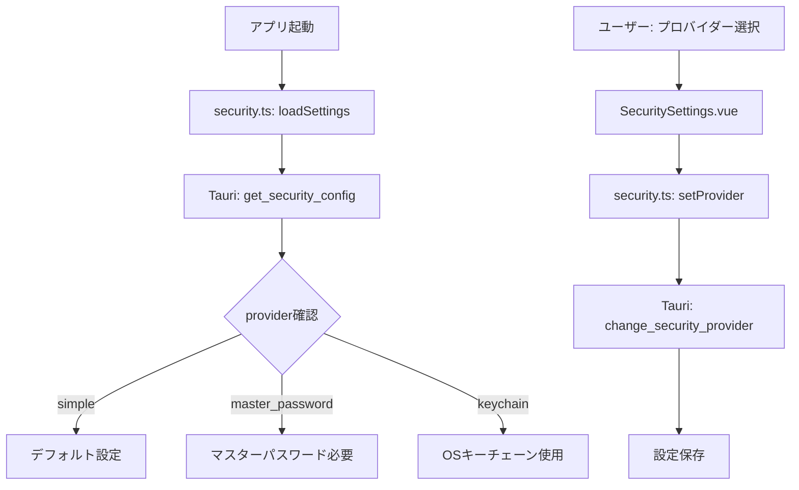

# 3.2.3 Simpleプロバイダー統合

**フェーズ**: 1.5b Phase 3 - サブフェーズ3.2
**作成日**: 2025-12-14
**工数**: 0.5日

---

## 目的

バックエンドで実装済みのSimpleプロバイダーをフロントエンドに統合し、3つのセキュリティプロバイダーすべてを利用可能にする。

---

## 背景

### 現状の問題点

1. **バックエンド**: 3つのプロバイダーすべて実装済み（`Simple`, `MasterPassword`, `Keychain`）
2. **フロントエンド**: 2つのみ対応（`'system'`, `'master-password'`）
3. **型名の不一致**: フロントエンド `'system'` vs バックエンド `Keychain`

### 影響

- デフォルトプロバイダー（Simple）が選択できない
- 初心者ユーザーがパスワード設定を強制される
- 要件定義書との不一致

---

## 実装内容

### 1. 型定義の修正

**ファイル**: `app/types/index.ts`

```typescript
/**
 * セキュリティプロバイダー
 */
export type SecurityProvider = 'simple' | 'master-password' | 'keychain'
```

**変更点**:
- `'simple'`を追加（デフォルト）
- `'system'` → `'keychain'`に変更（バックエンドと一致）

---

### 2. ストアの更新

**ファイル**: `app/stores/security.ts`

**デフォルト設定の変更**:

```typescript
const defaultSecuritySettings: SecuritySettings = {
  provider: 'simple', // 'system' → 'simple'に変更
  level: 'medium',
  masterPasswordSet: false
}
```

**型定義の更新**:
- `SecurityProvider`型が更新されるため、自動的に対応

---

### 3. UIの更新

**ファイル**: `app/components/settings/SecuritySettings.vue`

**プロバイダー選択肢の更新**:

```vue
<script setup lang="ts">
const providerOptions: { label: string; value: SecurityProvider; description: string; recommended?: boolean }[] = [
  {
    label: 'Simple (推奨)',
    value: 'simple',
    description: '固定キーで暗号化。パスワード入力不要。',
    recommended: true
  },
  {
    label: 'マスターパスワード',
    value: 'master-password',
    description: 'ユーザー設定のパスワードで暗号化'
  },
  {
    label: 'OSキーチェーン',
    value: 'keychain', // 'system' → 'keychain'に変更
    description: 'OSのセキュアストレージに保存'
  }
]
</script>

<template>
  <USelect
    :model-value="settings.provider"
    :options="providerOptions"
    option-attribute="label"
    value-attribute="value"
    @update:model-value="updateProvider"
  >
    <template #option="{ option }">
      <div class="flex flex-col">
        <div class="flex items-center gap-2">
          <span class="font-medium">{{ option.label }}</span>
          <UBadge v-if="option.recommended" color="primary" variant="soft" size="xs">
            推奨
          </UBadge>
        </div>
        <span class="text-xs text-gray-500">{{ option.description }}</span>
      </div>
    </template>
  </USelect>
</template>
```

---

### 4. バックエンドコマンドの確認

**既存のバックエンドコマンド** (`src-tauri/src/commands/security.rs`):

- ✅ `get_available_providers()` - 3つのプロバイダー情報を返す
- ✅ `get_security_config()` - 現在の設定を取得
- ✅ `change_security_provider()` - プロバイダーを変更
- ✅ `switch_security_provider()` - プロバイダーを切り替え（再暗号化込み）

**型定義の確認** (`src-tauri/src/crypto/security_provider/types.rs`):

```rust
#[derive(Debug, Clone, Copy, PartialEq, Eq, Serialize, Deserialize)]
#[serde(rename_all = "snake_case")]
pub enum SecurityProviderType {
    Simple,
    MasterPassword,
    Keychain,
}
```

**シリアライズ形式**: `snake_case`のため、JSON上は `"simple"`, `"master_password"`, `"keychain"`

**問題**: フロントエンドの`'master-password'` vs バックエンドの`"master_password"`

---

### 5. 型名の統一（重要）

**方針**: バックエンドのシリアライズ形式に合わせる

**変更前**:
```typescript
export type SecurityProvider = 'system' | 'master-password'
```

**変更後**:
```typescript
export type SecurityProvider = 'simple' | 'master_password' | 'keychain'
```

**影響範囲**:
- `app/types/index.ts`
- `app/stores/security.ts`
- `app/components/settings/SecuritySettings.vue`

**既存データの移行**:
- `'system'` → `'keychain'`
- `'master-password'` → `'master_password'`

---

## データフロー



---

## 実装手順

### ステップ1: 型定義の更新 (0.1日)

1. `app/types/index.ts`を修正
   - `SecurityProvider`型を`'simple' | 'master_password' | 'keychain'`に変更

### ステップ2: ストアの更新 (0.1日)

2. `app/stores/security.ts`を修正
   - デフォルト値を`'simple'`に変更

### ステップ3: UIの更新 (0.2日)

3. `app/components/settings/SecuritySettings.vue`を修正
   - プロバイダー選択肢に`'simple'`を追加
   - `'system'` → `'keychain'`に変更
   - `'master-password'` → `'master_password'`に変更
   - 推奨バッジを追加

### ステップ4: 動作確認 (0.1日)

4. 動作確認
   - 3つのプロバイダーが選択できることを確認
   - バックエンドとの通信が正常に行われることを確認
   - 設定が正しく保存されることを確認

---

## 成果物

- [ ] `app/types/index.ts` - 型定義更新
- [ ] `app/stores/security.ts` - デフォルト値更新
- [ ] `app/components/settings/SecuritySettings.vue` - UI更新

---

## 動作確認項目

- [ ] 3つのプロバイダーが選択肢に表示される
- [ ] `simple`がデフォルト・推奨として表示される
- [ ] 各プロバイダーが正しく選択できる
- [ ] 選択したプロバイダーがバックエンドに正しく反映される
- [ ] `master_password`選択時にマスターパスワード設定セクションが表示される
- [ ] エラーが発生しない

---

## 既存データの移行

### 設定ファイルの移行

**移行ロジック** (バックエンド側で実装):

```rust
// src-tauri/src/crypto/security_provider/config.rs

impl SecurityConfig {
    pub fn migrate(&mut self) {
        // 旧型名を新型名に変換
        match self.provider_type {
            // 既にsnake_case形式なので移行不要
            _ => {}
        }
    }
}
```

**注**: バックエンドは既に`snake_case`形式なので、フロントエンド側のみ修正すれば良い。

---

## セキュリティ考慮事項

### Simpleプロバイダーの制限

- **用途**: 個人開発、ローカル環境、低セキュリティ要件
- **警告表示**: 本番環境や機密データには推奨しない旨を明示
- **デフォルト理由**: UXの簡便性を優先（パスワード入力不要）

### 警告表示の追加

**UI更新案**:

```vue
<UAlert
  v-if="settings.provider === 'simple'"
  color="amber"
  variant="soft"
  icon="i-heroicons-exclamation-triangle"
>
  Simpleプロバイダーは固定キーで暗号化します。
  本番環境や機密データにはマスターパスワードまたはOSキーチェーンを推奨します。
</UAlert>
```

---

## 今後の拡張

### Phase 2以降で検討

- プロバイダーごとの詳細情報表示（比較表）
- セキュリティレベルのビジュアル表示
- プロバイダー変更時の警告強化

---

## 備考

- バックエンドは既に実装済みなので、フロントエンド側の統合のみで完了
- 型名の統一により、今後の開発でのバグを防止
- デフォルトをSimpleにすることで、初心者ユーザーのUXを向上

---

## 依存関係

**前提条件**:
- ✅ バックエンドのSimpleプロバイダー実装済み
- ✅ `get_available_providers`コマンド実装済み

**次のステップ**:
- 3.2.4 マスターパスワード起動時検証ダイアログ
- 3.2.5 プロバイダー変更確認ダイアログ
