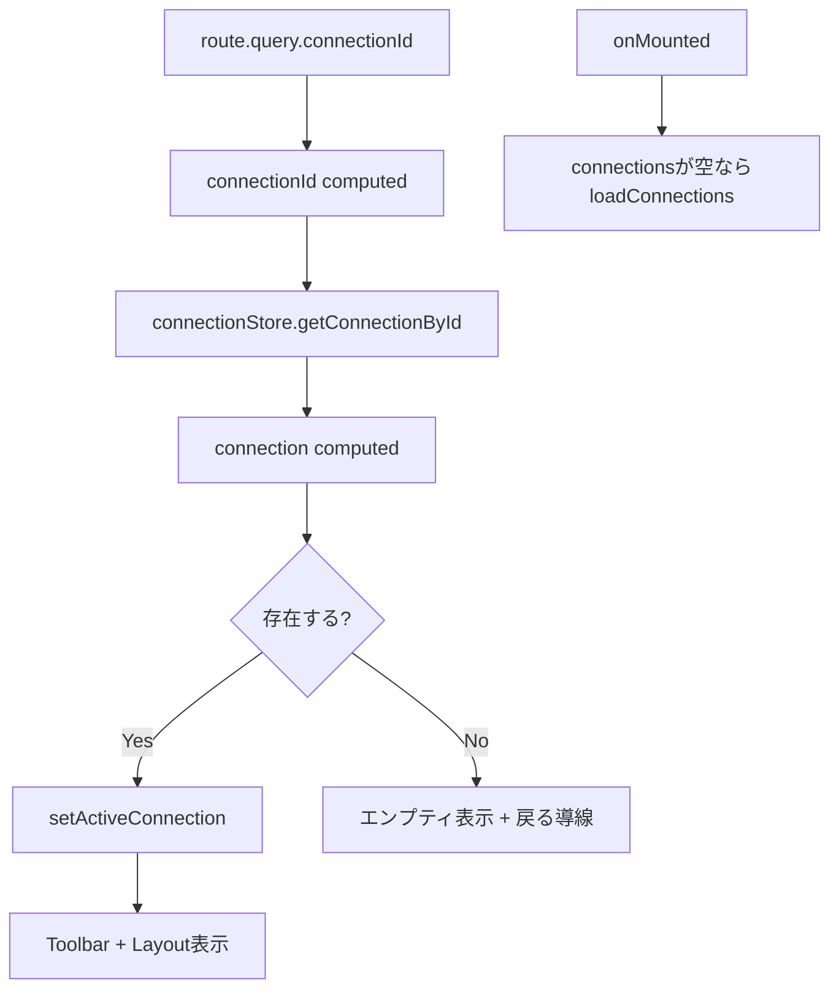

# 3.3.1 pages/query-builder.vue

**フェーズ**: 1.5b Phase 3 - サブフェーズ3.3  
**作成日**: 2025-12-12  
**工数**: 1日

---

## 目的

クエリビルダーのメインページ実装。接続IDを基点にアクティブ接続をセットし、ツールバーとキャンバスレイアウトを表示する。

---

## 実装内容

### ファイル構成

**`app/pages/query-builder.vue`**

### ページ仕様

- **パス**: `/query-builder`
- **クエリ**: `connectionId`（必須）
- **導線**: ランチャー/接続一覧からの「ビルダー」遷移を想定
- **状態遷移**: ローディング → エラー/エンプティ → コンテンツ表示

### 実装コード

```vue
<script setup lang="ts">
import { storeToRefs } from 'pinia'

const route = useRoute()
const router = useRouter()
const connectionStore = useConnectionStore()
const { connections, loading, error, activeConnection } = storeToRefs(connectionStore)

const connectionId = computed(() => route.query.connectionId as string | undefined)
const connection = computed(() => (connectionId.value ? connectionStore.getConnectionById(connectionId.value) ?? null : null))
const pageLoading = computed(() => loading.value && !connection.value)

const loadIfNeeded = async () => {
  if (!connections.value.length) {
    await connectionStore.loadConnections()
  }
}

const setActive = () => {
  if (connection.value) {
    connectionStore.setActiveConnection(connection.value)
  }
}

onMounted(async () => {
  await loadIfNeeded()
  setActive()
})

watch(connection, (next) => {
  if (next && activeConnection.value?.id !== next.id) {
    connectionStore.setActiveConnection(next)
  }
})

const goHome = () => router.push('/')
</script>

<template>
  <div class="min-h-screen bg-gray-50 dark:bg-gray-900">
    <EnvironmentHeader :environment="connection?.environment ?? 'development'" />

    <main class="h-[calc(100vh-64px)] flex flex-col">
      <div v-if="pageLoading" class="flex-1 flex items-center justify-center">
        <UIcon name="i-heroicons-arrow-path" class="w-8 h-8 animate-spin text-gray-500" />
      </div>

      <UAlert
        v-else-if="error"
        color="red"
        variant="soft"
        icon="i-heroicons-exclamation-triangle"
        class="m-4"
      >
        接続情報の取得に失敗しました。再読み込みしてください。
      </UAlert>

      <div v-else-if="!connection" class="flex-1 flex items-center justify-center">
        <div class="text-center space-y-3">
          <p class="text-xl text-gray-600 dark:text-gray-300">接続が見つかりません</p>
          <div class="flex justify-center gap-3">
            <UButton to="/" variant="ghost">ホームに戻る</UButton>
            <UButton to="/" color="primary" variant="solid">接続一覧を開く</UButton>
          </div>
        </div>
      </div>

      <div v-else class="flex-1 flex flex-col overflow-hidden">
        <QueryBuilderToolbar :connection="connection" />
        <div class="flex-1 overflow-hidden">
          <QueryBuilderLayout />
        </div>
      </div>
    </main>
  </div>
</template>
```

---

## 技術仕様

### UI構造

```
┌─────────────────────────────┐
│ EnvironmentHeader            │ 64px
├─────────────────────────────┤
│ (ローディング/エラー/空表示) │
├─────────────────────────────┤
│ QueryBuilderToolbar          │ 48px
├─────────────────────────────┤
│ QueryBuilderLayout           │ flex-1 (3カラム) |
└─────────────────────────────┘
```

### 状態・ロジック

- `connectionId`: クエリから取得（必須）。未指定/不正はエンプティ表示。
- `loadConnections`: 接続一覧が未ロードの場合のみ実行。
- `setActiveConnection`: 接続取得後に設定し、子コンポーネントで利用可能にする。
- `pageLoading`: 接続未取得かつストアが読み込み中の場合にスピナー表示。
- `error`: ストアのエラーを `UAlert` で一般化表示。

### 使用コンポーネント

- `EnvironmentHeader`（既存）
- `QueryBuilderToolbar`（3.3.xで実装）
- `QueryBuilderLayout`（3.3.xで実装）
- `UAlert` / `UIcon` / `UButton`（Nuxt UI）

### 使用Composable / ストア

- `useRoute` / `useRouter`
- `useConnectionStore`
  - `loadConnections()`
  - `getConnectionById(id)`
  - `setActiveConnection(connection)`
  - `connections` / `loading` / `error` / `activeConnection`

### データフロー



---

## 成果物

- [ ] `app/pages/query-builder.vue`

---

## 動作確認項目

- [ ] `/query-builder?connectionId=xxx` でアクティブ接続が設定される
- [ ] 接続未取得時はスピナーが表示される
- [ ] ストアのエラー時にアラートが表示される
- [ ] 不正な接続ID時にエンプティ表示とホーム導線が出る
- [ ] ツールバーと3カラムレイアウトが表示される

---

## 依存関係

**前提条件**:
- ✅ `useConnectionStore()` が実装済み（`get_connection*` Tauriコマンド利用可能）
- ✅ `EnvironmentHeader` が実装済み
- ✅ QueryBuilder系コンポーネント（Toolbar/Layout）が本サブフェーズで実装される

**次のステップ**:
- `QueryBuilderToolbar.vue` の実装
- `QueryBuilderLayout.vue` の実装（3.3.2）

---

## 備考

- 直接URLアクセス時を考慮し、接続一覧未ロードなら取得してから表示する。
- エラー文言は一般化し、詳細はコンソール/ログで確認する方針。***
