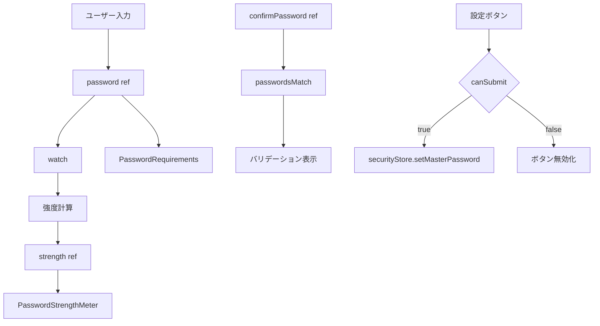

# 3.2.1 MasterPasswordSetupDialog.vue

**フェーズ**: 1.5b Phase 3 - サブフェーズ3.2
**作成日**: 2025-12-12
**工数**: 1日

---

## 目的

マスターパスワード設定・変更ダイアログの実装

---

## 実装内容

### ファイル構成

**`app/components/security/MasterPasswordSetupDialog.vue`**

---

### 実装コード

```vue
<script setup lang="ts">
import { storeToRefs } from 'pinia'

const isOpen = defineModel<boolean>()

const securityStore = useSecurityStore()
const { loading } = storeToRefs(securityStore)

const password = ref('')
const confirmPassword = ref('')
const strength = ref(0)
const showPassword = ref(false)
const message = ref<string | null>(null)

const passwordsMatch = computed(() => {
  if (!confirmPassword.value) return true
  return password.value === confirmPassword.value
})

const validation = computed(() => ({
  minLength: password.value.length >= 8,
  hasLowercase: /[a-z]/.test(password.value),
  hasUppercase: /[A-Z]/.test(password.value),
  hasNumber: /[0-9]/.test(password.value),
  hasSpecial: /[^a-zA-Z0-9]/.test(password.value),
  passwordsMatch: passwordsMatch.value
}))

const canSubmit = computed(() => {
  const v = validation.value
  return v.minLength && v.hasLowercase && v.hasUppercase && v.hasNumber && v.passwordsMatch
})

watch(password, (newPassword) => {
  let strengthValue = 0
  if (newPassword.length >= 8) strengthValue++
  if (/[a-z]/.test(newPassword)) strengthValue++
  if (/[A-Z]/.test(newPassword)) strengthValue++
  if (/[0-9]/.test(newPassword)) strengthValue++
  if (/[^a-zA-Z0-9]/.test(newPassword)) strengthValue++
  strength.value = strengthValue
})

const reset = () => {
  password.value = ''
  confirmPassword.value = ''
  message.value = null
}

const setupPassword = async () => {
  message.value = null
  try {
    await securityStore.setMasterPassword(password.value)
    isOpen.value = false
    reset()
  } catch (error) {
    message.value = '設定に失敗しました。時間をおいて再度お試しください。'
  }
}

watch(isOpen, (open) => {
  if (!open) reset()
})
</script>

<template>
  <UModal v-model="isOpen" :prevent-close="true">
    <UCard>
      <template #header>
        <div class="flex items-center justify-between gap-2">
          <h3 class="text-xl font-semibold">マスターパスワード設定</h3>
          <UBadge v-if="loading" color="primary" variant="soft">処理中</UBadge>
        </div>
      </template>

      <div class="space-y-4">
        <p class="text-sm text-gray-600 dark:text-gray-300">
          接続情報を保護するパスワードを設定します。忘れると復元できません。
        </p>

        <UFormGroup label="パスワード" required>
          <UInput
            v-model="password"
            :type="showPassword ? 'text' : 'password'"
            placeholder="8文字以上"
            autocomplete="new-password"
          />
        </UFormGroup>

        <PasswordStrengthMeter :password="password" :strength="strength" />

        <UFormGroup label="パスワード確認" required>
          <UInput
            v-model="confirmPassword"
            :type="showPassword ? 'text' : 'password'"
            placeholder="もう一度入力"
            autocomplete="new-password"
          />
          <p v-if="!passwordsMatch" class="text-sm text-red-600 mt-1">
            パスワードが一致しません
          </p>
        </UFormGroup>

        <UToggle v-model="showPassword">
          パスワードを表示
        </UToggle>

        <PasswordRequirements :validation="validation" />

        <UAlert
          v-if="message"
          color="red"
          variant="soft"
          icon="i-heroicons-exclamation-triangle"
        >
          {{ message }}
        </UAlert>
      </div>

      <template #footer>
        <div class="flex gap-2 justify-end">
          <UButton variant="outline" @click="isOpen = false">
            キャンセル
          </UButton>
          <UButton color="primary" :loading="loading" :disabled="!canSubmit || loading" @click="setupPassword">
            設定
          </UButton>
        </div>
      </template>
    </UCard>
  </UModal>
</template>
```

---

## 技術仕様

### パスワード強度計算

| 条件 | 加算ポイント |
|------|------------|
| 8文字以上 | +1 |
| 小文字を含む | +1 |
| 大文字を含む | +1 |
| 数字を含む | +1 |
| 記号を含む | +1 |

**強度レベル**:
- 0-2: 弱い（赤）
- 3: 中程度（黄）
- 4-5: 強い（緑）

### バリデーション

```typescript
interface PasswordValidation {
  minLength: boolean      // 8文字以上
  hasLowercase: boolean   // 小文字を含む
  hasUppercase: boolean   // 大文字を含む
  hasNumber: boolean      // 数字を含む
  hasSpecial: boolean     // 記号を含む
  passwordsMatch: boolean // 確認パスワードが一致
}
```

### 送信条件

```typescript
const canSubmit = computed(() => {
  return password.value.length >= 8 &&      // 最低8文字
         passwordsMatch.value &&            // パスワード一致
         strength.value >= 3                // 強度3以上
})
```

---

## 使用コンポーネント

- `UModal` - モーダルダイアログ
- `UCard` - カード
- `UFormGroup` - フォームグループ
- `UInput` - 入力フィールド
- `UToggle` - トグルスイッチ
- `UButton` - ボタン
- `PasswordStrengthMeter` - パスワード強度メーター（同時実装）
- `PasswordRequirements` - パスワード要件表示（同時実装）

---

## データフロー



---

## UI状態管理

### モーダルの開閉

```vue
const isOpen = defineModel<boolean>()
```

- 親コンポーネントから`v-model`で制御
- `prevent-close`で誤クローズを防止

### パスワード表示切替

```vue
const showPassword = ref(false)
```

- トグルで表示/非表示を切り替え
- 両方のインプットに適用

---

## セキュリティ考慮事項

### メモリ管理

- パスワードはref()で管理し、モーダル閉鎖/送信後に即クリア
- クリップボードコピーは不可、オートコンプリートは`new-password`

### 入力制限

- 最低8文字必須、大小英字・数字を含める（記号は任意）
- 強度3以上を推奨（メーター表示）
- 確認パスワード一致必須

### エラーハンドリング

```typescript
try {
  await securityStore.setMasterPassword(password.value)
  // 成功処理
} catch (error) {
  // エラーを一般化してUI表示（詳細はログで確認）
}
```

---

## 成果物

- [ ] `app/components/security/MasterPasswordSetupDialog.vue`
- [ ] `app/components/security/PasswordStrengthMeter.vue`
- [ ] `app/components/security/PasswordRequirements.vue`

---

## 動作確認項目

- [ ] ダイアログが開く
- [ ] パスワード入力で強度が計算される
- [ ] 強度メーターが視覚的に表示される
- [ ] パスワード要件が表示される
- [ ] 確認パスワードの不一致時にエラー表示
- [ ] パスワード表示トグルが動作する
- [ ] 条件を満たさない場合、設定ボタンが無効化される
- [ ] 設定に成功するとダイアログが閉じる
- [ ] キャンセルでダイアログが閉じる

---

## 依存関係

**前提条件**:
- ✅ `useSecurityStore()` が実装されている
- ✅ Tauri側のパスワード暗号化APIが実装されている

**同時実装コンポーネント**:
- `PasswordStrengthMeter.vue`
- `PasswordRequirements.vue`

**ストア要件**:

```typescript
interface SecurityStore {
  setMasterPassword(password: string): Promise<void>
  changeMasterPassword(oldPassword: string, newPassword: string): Promise<void>
}
```

---

## パスワード変更モード

### 将来の拡張（Phase 2以降）

```vue
<script setup lang="ts">
const props = defineProps<{
  mode: 'setup' | 'change'
}>()

const oldPassword = ref('')

const changePassword = async () => {
  if (props.mode === 'change') {
    await securityStore.changeMasterPassword(
      oldPassword.value,
      password.value
    )
  } else {
    await securityStore.setMasterPassword(password.value)
  }
}
</script>
```

---

## 今後の拡張

### Phase 2以降で追加予定

- パスワード変更時の現在パスワード確認（changeモードを追加）
- パスワードヒント機能
- パスワード生成機能（安全なランダム生成と自動貼り付け）
- パスワード履歴（再利用防止）
- パスワード有効期限
- バックエンドエラー時の再試行UIと詳細エラー表示（開発者向けログに限定）

---

## 備考

- パスワードは一度設定すると復元不可
- ユーザーに十分な警告を表示
- 強度メーターで視覚的にフィードバック
- 要件チェックリストで明確なガイダンス
