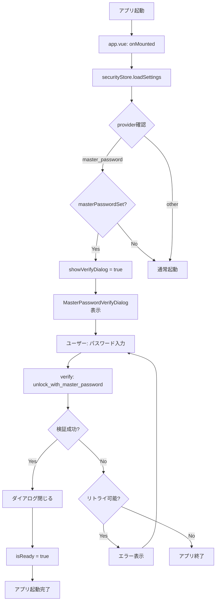

# 3.2.4 MasterPasswordVerifyDialog.vue

**フェーズ**: 1.5b Phase 3 - サブフェーズ3.2
**作成日**: 2025-12-14
**工数**: 1日

---

## 目的

マスターパスワードプロバイダー使用時、アプリ起動時にパスワード入力を求めるダイアログを実装する。

---

## 機能要件

### 基本機能

1. **起動時自動表示**
   - プロバイダーが`master_password`の場合に自動表示
   - パスワード未設定の場合は表示しない

2. **パスワード検証**
   - 入力されたパスワードをバックエンドで検証
   - 検証成功時: ダイアログを閉じてアプリ起動
   - 検証失敗時: エラー表示とリトライ

3. **リトライ制限**
   - 最大3回まで試行可能
   - 3回失敗後はアプリを終了

4. **セキュリティ機能**
   - パスワード表示/非表示の切り替え
   - ダイアログを閉じられない（`prevent-close`）
   - リトライ間隔を0.5秒設定（ブルートフォース対策）

---

## 実装内容

### ファイル構成

**`app/components/security/MasterPasswordVerifyDialog.vue`**

---

### 実装コード

```vue
<script setup lang="ts">
import { storeToRefs } from 'pinia'
import { useSecurityStore } from '~/stores/security'

const props = defineProps<{
  maxRetries?: number
}>()

const isOpen = defineModel<boolean>()

const securityStore = useSecurityStore()
const { loading } = storeToRefs(securityStore)

const password = ref('')
const showPassword = ref(false)
const errorMessage = ref<string | null>(null)
const retryCount = ref(0)
const maxRetries = computed(() => props.maxRetries ?? 3)

const remainingAttempts = computed(() => maxRetries.value - retryCount.value)
const canRetry = computed(() => retryCount.value < maxRetries.value)

const verify = async () => {
  errorMessage.value = null

  // リトライ間隔（ブルートフォース対策）
  if (retryCount.value > 0) {
    await new Promise(resolve => setTimeout(resolve, 500))
  }

  try {
    const success = await securityStore.verifyMasterPassword(password.value)

    if (success) {
      // 検証成功
      isOpen.value = false
      password.value = ''
      retryCount.value = 0
      errorMessage.value = null
    } else {
      // 検証失敗
      retryCount.value++
      password.value = ''

      if (canRetry.value) {
        errorMessage.value = `パスワードが正しくありません。残り ${remainingAttempts.value} 回試行できます。`
      } else {
        errorMessage.value = '試行回数の上限に達しました。アプリを終了します。'
        // 3秒後にアプリを終了
        setTimeout(() => {
          window.close()
        }, 3000)
      }
    }
  } catch (error) {
    errorMessage.value = 'パスワードの検証に失敗しました。再度お試しください。'
  }
}

const handleKeydown = (event: KeyboardEvent) => {
  if (event.key === 'Enter' && password.value && canRetry.value && !loading.value) {
    verify()
  }
}

// パスワード忘れた場合のガイダンスを表示
const showForgotPasswordHelp = ref(false)
</script>

<template>
  <UModal v-model="isOpen" :prevent-close="true">
    <UCard>
      <template #header>
        <div class="flex items-center gap-2">
          <UIcon name="i-heroicons-lock-closed" class="w-5 h-5 text-primary-500" />
          <h3 class="text-xl font-semibold">マスターパスワード入力</h3>
        </div>
      </template>

      <div class="space-y-5">
        <p class="text-sm text-gray-600 dark:text-gray-300">
          接続情報にアクセスするため、マスターパスワードを入力してください。
        </p>

        <UFormField
          label="マスターパスワード"
          :hint="canRetry ? `残り ${remainingAttempts} 回試行できます` : ''"
          required
        >
          <UInput
            v-model="password"
            :type="showPassword ? 'text' : 'password'"
            placeholder="パスワードを入力"
            autocomplete="current-password"
            :disabled="!canRetry || loading"
            @keydown="handleKeydown"
          />
        </UFormField>

        <div class="flex items-center justify-between">
          <span class="text-sm text-gray-700 dark:text-gray-200">パスワードを表示</span>
          <USwitch v-model="showPassword" :disabled="!canRetry" />
        </div>

        <UAlert
          v-if="errorMessage"
          :color="canRetry ? 'red' : 'amber'"
          variant="soft"
          :icon="canRetry ? 'i-heroicons-exclamation-triangle' : 'i-heroicons-x-circle'"
        >
          {{ errorMessage }}
        </UAlert>

        <div v-if="canRetry" class="border-t pt-4">
          <button
            type="button"
            class="text-sm text-primary-600 hover:text-primary-700 dark:text-primary-400 dark:hover:text-primary-300"
            @click="showForgotPasswordHelp = !showForgotPasswordHelp"
          >
            パスワードを忘れた場合
          </button>

          <UAlert
            v-if="showForgotPasswordHelp"
            color="amber"
            variant="soft"
            icon="i-heroicons-information-circle"
            class="mt-3"
          >
            <template #title>パスワードを忘れた場合</template>
            <div class="text-sm space-y-2 mt-2">
              <p>マスターパスワードは復元できません。以下の方法で対処してください:</p>
              <ul class="list-disc list-inside space-y-1 ml-2">
                <li>設定ファイルを削除して初期化（接続情報は失われます）</li>
                <li>バックアップから復元</li>
                <li>サポートに問い合わせ</li>
              </ul>
            </div>
          </UAlert>
        </div>
      </div>

      <template #footer>
        <div class="flex gap-2 justify-end">
          <UButton
            color="primary"
            :loading="loading"
            :disabled="!password || !canRetry || loading"
            @click="verify"
          >
            ロック解除
          </UButton>
        </div>
      </template>
    </UCard>
  </UModal>
</template>
```

---

## 起動フロー統合

### アプリ起動時の処理

**ファイル**: `app/app.vue`

```vue
<script setup lang="ts">
import { storeToRefs } from 'pinia'
import { useSecurityStore } from '~/stores/security'

const securityStore = useSecurityStore()
const { settings } = storeToRefs(securityStore)

const showVerifyDialog = ref(false)
const isReady = ref(false)

onMounted(async () => {
  // セキュリティ設定を読み込み
  await securityStore.loadSettings()

  // マスターパスワードプロバイダーかつ設定済みの場合
  if (
    settings.value.provider === 'master_password' &&
    settings.value.masterPasswordSet
  ) {
    // 検証ダイアログを表示
    showVerifyDialog.value = true
  } else {
    // それ以外は通常起動
    isReady.value = true
  }
})

// 検証ダイアログが閉じられたら起動完了
watch(showVerifyDialog, (open) => {
  if (!open && settings.value.provider === 'master_password') {
    isReady.value = true
  }
})
</script>

<template>
  <div>
    <!-- 起動中の場合はローディング表示 -->
    <div v-if="!isReady" class="flex items-center justify-center h-screen">
      <div class="text-center space-y-4">
        <UIcon name="i-heroicons-lock-closed" class="w-16 h-16 text-primary-500 mx-auto" />
        <p class="text-lg text-gray-600 dark:text-gray-300">起動中...</p>
      </div>
    </div>

    <!-- アプリ本体 -->
    <div v-else>
      <NuxtPage />
    </div>

    <!-- マスターパスワード検証ダイアログ -->
    <MasterPasswordVerifyDialog v-model="showVerifyDialog" />
  </div>
</template>
```

---

## ストア拡張

**ファイル**: `app/stores/security.ts`

既に実装済みの`verifyMasterPassword()`メソッドを利用:

```typescript
async verifyMasterPassword(password: string): Promise<boolean> {
  try {
    const { invokeCommand, isAvailable } = useTauri()

    if (!isAvailable.value) {
      return false
    }

    return await invokeCommand<boolean>('verify_master_password', { password })
  } catch (error) {
    console.error('Failed to verify master password:', error)
    return false
  }
}
```

---

## バックエンドコマンド

**既存コマンド** (`src-tauri/src/commands/security.rs`):

```rust
/// マスターパスワードでアンロック
#[tauri::command]
pub async fn unlock_with_master_password(
    manager: State<'_, Arc<SecurityProviderManager>>,
    password: String,
) -> Result<(), String> {
    manager
        .unlock(UnlockParams::MasterPassword { password })
        .await
        .map_err(|e| e.to_string())
}
```

**フロントエンド側の修正**:

ストアの`verifyMasterPassword()`を`unlock_with_master_password`コマンドを呼び出すように修正:

```typescript
async verifyMasterPassword(password: string): Promise<boolean> {
  try {
    const { invokeCommand, isAvailable } = useTauri()

    if (!isAvailable.value) {
      return false
    }

    // 修正: verify_master_password → unlock_with_master_password
    await invokeCommand('unlock_with_master_password', { password })
    return true
  } catch (error) {
    console.error('Failed to verify master password:', error)
    return false
  }
}
```

---

## データフロー



---

## 成果物

- [ ] `app/components/security/MasterPasswordVerifyDialog.vue`
- [ ] `app/app.vue` - 起動フロー統合
- [ ] `app/stores/security.ts` - `verifyMasterPassword()`修正

---

## 動作確認項目

- [ ] マスターパスワードプロバイダー使用時、起動時にダイアログが表示される
- [ ] 正しいパスワードを入力するとダイアログが閉じてアプリが起動する
- [ ] 間違ったパスワードを入力するとエラーが表示される
- [ ] リトライ回数が正しくカウントされる
- [ ] 3回失敗後、アプリが終了する
- [ ] パスワード表示切り替えが動作する
- [ ] パスワード忘れた場合のガイダンスが表示される
- [ ] Enterキーで検証できる

---

## セキュリティ考慮事項

### ブルートフォース対策

- リトライ間隔: 0.5秒
- 最大試行回数: 3回
- 失敗時のログ記録（バックエンド側）

### メモリ管理

- パスワードは検証後すぐにクリア
- セッション中はバックエンドでキーをキャッシュ

### エラーハンドリング

- 一般化されたエラーメッセージ
- 詳細はログに記録（フロントエンドには表示しない）

---

## 今後の拡張

### Phase 2以降で検討

- パスワードヒント機能
- 生体認証（Touch ID/Face ID/Windows Hello）
- リトライ間隔の段階的増加（1回目: 0.5秒、2回目: 1秒、3回目: 2秒）
- ログアウト機能（手動でロック）

---

## 備考

- ダイアログは`prevent-close`で閉じられない
- アプリ終了は`window.close()`で実装
- バックエンドのキーキャッシュはセッション中保持（Phase 2でタイムアウト実装）

---

## 依存関係

**前提条件**:
- ✅ `useSecurityStore()` 実装済み
- ✅ バックエンド`unlock_with_master_password`コマンド実装済み

**次のステップ**:
- 3.2.5 プロバイダー変更確認ダイアログ
- 3.3.1 セッションタイムアウト設定（Phase 2）
