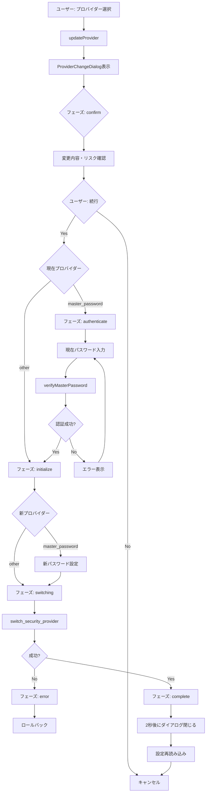

# 3.2.5 ProviderChangeDialog.vue

**フェーズ**: 1.5b Phase 3 - サブフェーズ3.2
**作成日**: 2025-12-14
**工数**: 1日

---

## 目的

セキュリティプロバイダー変更時に確認ダイアログを表示し、安全に再暗号化を実行する。

---

## 機能要件

### 基本機能

1. **変更内容の確認**
   - 現在のプロバイダー → 新しいプロバイダー
   - 各プロバイダーの特徴説明
   - リスク警告の表示

2. **認証フロー**
   - 現在のプロバイダーで認証
   - 新しいプロバイダーの初期化（必要な場合）

3. **再暗号化処理**
   - 既存の認証情報を復号
   - 新しいプロバイダーで再暗号化
   - 進捗表示

4. **エラーハンドリング**
   - 失敗時のロールバック
   - エラー詳細の表示

---

## 実装内容

### ファイル構成

**`app/components/security/ProviderChangeDialog.vue`**

---

### 実装コード

```vue
<script setup lang="ts">
import { storeToRefs } from 'pinia'
import { useSecurityStore } from '~/stores/security'
import type { SecurityProvider } from '~/types'

interface ProviderChangeParams {
  from: SecurityProvider
  to: SecurityProvider
}

const props = defineProps<{
  params: ProviderChangeParams
}>()

const isOpen = defineModel<boolean>()

const securityStore = useSecurityStore()
const { loading } = storeToRefs(securityStore)

// フェーズ管理
type Phase = 'confirm' | 'authenticate' | 'initialize' | 'switching' | 'complete' | 'error'
const currentPhase = ref<Phase>('confirm')

// 認証情報
const currentPassword = ref('')
const newPassword = ref('')
const newPasswordConfirm = ref('')
const showPassword = ref(false)

// エラー管理
const errorMessage = ref<string | null>(null)

// プロバイダー情報
const providerInfo = computed(() => ({
  simple: {
    name: 'Simple',
    description: '固定キーで暗号化。パスワード入力不要。',
    securityLevel: 1
  },
  master_password: {
    name: 'マスターパスワード',
    description: 'ユーザー設定のパスワードで暗号化。起動時に入力が必要。',
    securityLevel: 2
  },
  keychain: {
    name: 'OSキーチェーン',
    description: 'OSのセキュアストレージを使用。OS認証が必要な場合あり。',
    securityLevel: 3
  }
}))

const fromInfo = computed(() => providerInfo.value[props.params.from])
const toInfo = computed(() => providerInfo.value[props.params.to])

// バリデーション
const canProceed = computed(() => {
  if (currentPhase.value === 'confirm') return true
  if (currentPhase.value === 'authenticate') {
    return props.params.from === 'master_password' ? !!currentPassword.value : true
  }
  if (currentPhase.value === 'initialize') {
    return props.params.to === 'master_password'
      ? newPassword.value.length >= 8 && newPassword.value === newPasswordConfirm.value
      : true
  }
  return false
})

// フェーズ進行
const nextPhase = async () => {
  errorMessage.value = null

  try {
    if (currentPhase.value === 'confirm') {
      // 認証フェーズへ
      if (props.params.from === 'master_password') {
        currentPhase.value = 'authenticate'
      } else {
        currentPhase.value = 'initialize'
      }
    } else if (currentPhase.value === 'authenticate') {
      // 現在のプロバイダーで認証
      const success = await securityStore.verifyMasterPassword(currentPassword.value)
      if (!success) {
        errorMessage.value = 'パスワードが正しくありません'
        return
      }
      currentPhase.value = 'initialize'
    } else if (currentPhase.value === 'initialize') {
      // 新しいプロバイダーへ切り替え
      currentPhase.value = 'switching'
      await switchProvider()
    }
  } catch (error) {
    currentPhase.value = 'error'
    errorMessage.value = error instanceof Error ? error.message : '不明なエラーが発生しました'
  }
}

// プロバイダー切り替え処理
const switchProvider = async () => {
  try {
    const { invokeCommand, isAvailable } = useTauri()

    if (!isAvailable.value) {
      throw new Error('Tauri環境が利用できません')
    }

    // バックエンドの switch_security_provider コマンドを呼び出し
    await invokeCommand('switch_security_provider', {
      target_provider: props.params.to,
      current_password: props.params.from === 'master_password' ? currentPassword.value : null,
      new_password: props.params.to === 'master_password' ? newPassword.value : null,
      new_password_confirm: props.params.to === 'master_password' ? newPasswordConfirm.value : null
    })

    currentPhase.value = 'complete'

    // 設定を再読み込み
    await securityStore.loadSettings()

    // 2秒後にダイアログを閉じる
    setTimeout(() => {
      isOpen.value = false
      reset()
    }, 2000)
  } catch (error) {
    currentPhase.value = 'error'
    errorMessage.value = error instanceof Error ? error.message : 'プロバイダーの切り替えに失敗しました'
  }
}

const reset = () => {
  currentPhase.value = 'confirm'
  currentPassword.value = ''
  newPassword.value = ''
  newPasswordConfirm.value = ''
  showPassword.value = false
  errorMessage.value = null
}

const cancel = () => {
  isOpen.value = false
  reset()
}

watch(isOpen, (open) => {
  if (!open) reset()
})
</script>

<template>
  <UModal v-model="isOpen" :prevent-close="currentPhase === 'switching'">
    <UCard>
      <template #header>
        <div class="flex items-center gap-2">
          <UIcon name="i-heroicons-arrow-path" class="w-5 h-5 text-primary-500" />
          <h3 class="text-xl font-semibold">セキュリティプロバイダーの変更</h3>
        </div>
      </template>

      <div class="space-y-5">
        <!-- フェーズ: 確認 -->
        <div v-if="currentPhase === 'confirm'" class="space-y-4">
          <p class="text-sm text-gray-600 dark:text-gray-300">
            セキュリティプロバイダーを変更します。既存の接続情報は新しいプロバイダーで再暗号化されます。
          </p>

          <div class="grid grid-cols-2 gap-4">
            <UCard>
              <template #header>
                <div class="flex items-center gap-2">
                  <span class="text-sm font-medium text-gray-500">現在</span>
                </div>
              </template>
              <div class="space-y-2">
                <p class="font-semibold">{{ fromInfo.name }}</p>
                <p class="text-xs text-gray-600 dark:text-gray-400">{{ fromInfo.description }}</p>
                <div class="flex items-center gap-1">
                  <span class="text-xs text-gray-500">セキュリティレベル:</span>
                  <div class="flex gap-1">
                    <div
                      v-for="i in 3"
                      :key="i"
                      class="w-3 h-3 rounded-full"
                      :class="i <= fromInfo.securityLevel ? 'bg-primary-500' : 'bg-gray-200 dark:bg-gray-700'"
                    />
                  </div>
                </div>
              </div>
            </UCard>

            <UCard>
              <template #header>
                <div class="flex items-center gap-2">
                  <UIcon name="i-heroicons-arrow-right" class="w-4 h-4 text-primary-500" />
                  <span class="text-sm font-medium text-primary-600">新規</span>
                </div>
              </template>
              <div class="space-y-2">
                <p class="font-semibold">{{ toInfo.name }}</p>
                <p class="text-xs text-gray-600 dark:text-gray-400">{{ toInfo.description }}</p>
                <div class="flex items-center gap-1">
                  <span class="text-xs text-gray-500">セキュリティレベル:</span>
                  <div class="flex gap-1">
                    <div
                      v-for="i in 3"
                      :key="i"
                      class="w-3 h-3 rounded-full"
                      :class="i <= toInfo.securityLevel ? 'bg-primary-500' : 'bg-gray-200 dark:bg-gray-700'"
                    />
                  </div>
                </div>
              </div>
            </UCard>
          </div>

          <UAlert color="amber" variant="soft" icon="i-heroicons-exclamation-triangle">
            <template #title>重要な注意事項</template>
            <ul class="text-sm space-y-1 mt-2 list-disc list-inside">
              <li>変更中は接続情報にアクセスできません</li>
              <li>処理中にアプリを終了しないでください</li>
              <li>失敗時は元のプロバイダーに自動的に戻ります</li>
            </ul>
          </UAlert>
        </div>

        <!-- フェーズ: 認証 -->
        <div v-if="currentPhase === 'authenticate'" class="space-y-4">
          <p class="text-sm text-gray-600 dark:text-gray-300">
            現在のプロバイダーで認証してください。
          </p>

          <UFormField label="現在のマスターパスワード" required>
            <UInput
              v-model="currentPassword"
              :type="showPassword ? 'text' : 'password'"
              placeholder="パスワードを入力"
              autocomplete="current-password"
            />
          </UFormField>

          <div class="flex items-center justify-between">
            <span class="text-sm text-gray-700 dark:text-gray-200">パスワードを表示</span>
            <USwitch v-model="showPassword" />
          </div>
        </div>

        <!-- フェーズ: 初期化 -->
        <div v-if="currentPhase === 'initialize' && params.to === 'master_password'" class="space-y-4">
          <p class="text-sm text-gray-600 dark:text-gray-300">
            新しいマスターパスワードを設定してください。
          </p>

          <UFormField label="新しいマスターパスワード" hint="8文字以上" required>
            <UInput
              v-model="newPassword"
              :type="showPassword ? 'text' : 'password'"
              placeholder="8文字以上"
              autocomplete="new-password"
            />
          </UFormField>

          <UFormField label="パスワード確認" required>
            <UInput
              v-model="newPasswordConfirm"
              :type="showPassword ? 'text' : 'password'"
              placeholder="もう一度入力"
              autocomplete="new-password"
            />
            <p
              v-if="newPassword && newPasswordConfirm && newPassword !== newPasswordConfirm"
              class="text-sm text-rose-600 mt-1"
            >
              パスワードが一致しません
            </p>
          </UFormField>

          <div class="flex items-center justify-between">
            <span class="text-sm text-gray-700 dark:text-gray-200">パスワードを表示</span>
            <USwitch v-model="showPassword" />
          </div>
        </div>

        <!-- フェーズ: 切り替え中 -->
        <div v-if="currentPhase === 'switching'" class="space-y-4">
          <div class="flex flex-col items-center justify-center py-8">
            <UIcon name="i-heroicons-arrow-path" class="w-12 h-12 text-primary-500 animate-spin" />
            <p class="text-lg font-medium mt-4">プロバイダーを切り替え中...</p>
            <p class="text-sm text-gray-600 dark:text-gray-400 mt-2">
              接続情報を再暗号化しています。しばらくお待ちください。
            </p>
          </div>
        </div>

        <!-- フェーズ: 完了 -->
        <div v-if="currentPhase === 'complete'" class="space-y-4">
          <div class="flex flex-col items-center justify-center py-8">
            <UIcon name="i-heroicons-check-circle" class="w-12 h-12 text-emerald-500" />
            <p class="text-lg font-medium mt-4">切り替え完了</p>
            <p class="text-sm text-gray-600 dark:text-gray-400 mt-2">
              プロバイダーが正常に変更されました。
            </p>
          </div>
        </div>

        <!-- フェーズ: エラー -->
        <div v-if="currentPhase === 'error'" class="space-y-4">
          <UAlert color="red" variant="soft" icon="i-heroicons-x-circle">
            <template #title>エラーが発生しました</template>
            <p class="text-sm mt-2">{{ errorMessage }}</p>
          </UAlert>
        </div>

        <!-- 一般的なエラー表示 -->
        <UAlert
          v-if="errorMessage && currentPhase !== 'error'"
          color="red"
          variant="soft"
          icon="i-heroicons-exclamation-triangle"
        >
          {{ errorMessage }}
        </UAlert>
      </div>

      <template #footer>
        <div class="flex gap-2 justify-end">
          <UButton
            v-if="currentPhase !== 'switching' && currentPhase !== 'complete'"
            variant="outline"
            color="gray"
            :disabled="currentPhase === 'switching'"
            @click="cancel"
          >
            キャンセル
          </UButton>
          <UButton
            v-if="currentPhase === 'error'"
            color="primary"
            @click="reset"
          >
            やり直す
          </UButton>
          <UButton
            v-if="['confirm', 'authenticate', 'initialize'].includes(currentPhase)"
            color="primary"
            :loading="loading"
            :disabled="!canProceed || loading"
            @click="nextPhase"
          >
            {{ currentPhase === 'confirm' ? '続行' : currentPhase === 'authenticate' ? '認証' : '変更' }}
          </UButton>
        </div>
      </template>
    </UCard>
  </UModal>
</template>
```

---

## SecuritySettings.vueの統合

**ファイル**: `app/components/settings/SecuritySettings.vue`

```vue
<script setup lang="ts">
// ... 既存のコード ...

const showProviderChangeDialog = ref(false)
const providerChangeParams = ref<{ from: SecurityProvider; to: SecurityProvider } | null>(null)

const updateProvider = async (provider: SecurityProvider) => {
  // プロバイダー変更ダイアログを表示
  providerChangeParams.value = {
    from: settings.value.provider,
    to: provider
  }
  showProviderChangeDialog.value = true
}

// ダイアログが閉じられたら設定を再読み込み
watch(showProviderChangeDialog, async (open) => {
  if (!open) {
    await securityStore.loadSettings()
  }
})
</script>

<template>
  <div class="space-y-6">
    <!-- ... 既存のコード ... -->

    <ProviderChangeDialog
      v-if="providerChangeParams"
      v-model="showProviderChangeDialog"
      :params="providerChangeParams"
    />
  </div>
</template>
```

---

## データフロー



---

## 成果物

- [ ] `app/components/security/ProviderChangeDialog.vue`
- [ ] `app/components/settings/SecuritySettings.vue` - ダイアログ統合

---

## 動作確認項目

- [ ] プロバイダー選択時にダイアログが表示される
- [ ] 確認フェーズで変更内容が正しく表示される
- [ ] master_passwordからの変更時に認証フェーズが表示される
- [ ] master_passwordへの変更時に初期化フェーズが表示される
- [ ] 切り替え中の進捗が表示される
- [ ] 成功時に完了メッセージが表示される
- [ ] エラー時にエラーメッセージとロールバックが実行される
- [ ] キャンセルで元の設定に戻る

---

## セキュリティ考慮事項

### 再暗号化の安全性

- トランザクション的な処理（失敗時のロールバック）
- 処理中のアプリ終了を防止（`prevent-close`）
- バックアップの推奨（警告表示）

### パスワード管理

- 認証後すぐにパスワードをクリア
- メモリに平文で保持しない

---

## 備考

- バックエンドの`switch_security_provider`コマンドがトランザクション処理を実装
- ロールバック機能はバックエンド側で実装済み
- フロントエンドはフェーズ管理とUI表示に集中

---

## 依存関係

**前提条件**:
- ✅ バックエンド`switch_security_provider`コマンド実装済み
- ✅ `useSecurityStore()` 実装済み

**次のステップ**:
- 3.2.6 マスターパスワード変更機能
- 3.2.7 セキュリティ情報表示強化
