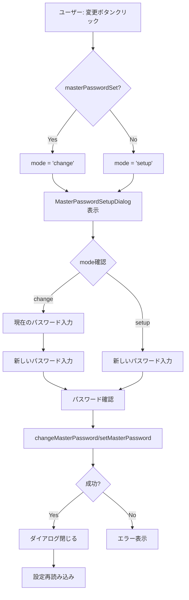

# 3.2.6 マスターパスワード変更機能

**フェーズ**: 1.5b Phase 3 - サブフェーズ3.2
**作成日**: 2025-12-14
**工数**: 0.75日

---

## 目的

既存のマスターパスワード設定ダイアログにパスワード変更機能を追加する。

---

## 機能要件

### 基本機能

1. **モード切り替え**
   - `setup`: 新規パスワード設定（既存機能）
   - `change`: パスワード変更（新機能）

2. **パスワード変更フロー**
   - 現在のパスワード入力
   - 現在のパスワード検証
   - 新しいパスワード設定
   - パスワード強度チェック
   - 確認パスワード入力

3. **セキュリティ機能**
   - 現在のパスワード検証
   - 新しいパスワードの強度チェック
   - 変更後の自動再暗号化

---

## 実装内容

### MasterPasswordSetupDialog.vueの拡張

**ファイル**: `app/components/security/MasterPasswordSetupDialog.vue`

```vue
<script setup lang="ts">
import { storeToRefs } from 'pinia'
import { useSecurityStore } from '~/stores/security'

const props = defineProps<{
  mode?: 'setup' | 'change'
}>()

const isOpen = defineModel<boolean>()

const securityStore = useSecurityStore()
const { loading } = storeToRefs(securityStore)

const mode = computed(() => props.mode ?? 'setup')

// 既存のパスワード（changeモード時のみ）
const currentPassword = ref('')

// 新しいパスワード
const password = ref('')
const confirmPassword = ref('')
const strength = ref(0)
const showPassword = ref(false)
const message = ref<string | null>(null)

const passwordsMatch = computed(() => {
  if (!confirmPassword.value) return true
  return password.value === confirmPassword.value
})

const validation = computed(() => ({
  minLength: password.value.length >= 8,
  hasLowercase: /[a-z]/.test(password.value),
  hasUppercase: /[A-Z]/.test(password.value),
  hasNumber: /[0-9]/.test(password.value),
  hasSpecial: /[^a-zA-Z0-9]/.test(password.value),
  passwordsMatch: passwordsMatch.value
}))

const canSubmit = computed(() => {
  const v = validation.value
  const meetsRequirements =
    v.minLength && v.hasLowercase && v.hasUppercase && v.hasNumber && v.passwordsMatch

  // changeモードの場合は現在のパスワードも必要
  if (mode.value === 'change') {
    return meetsRequirements && strength.value >= 3 && !loading.value && !!currentPassword.value
  }

  return meetsRequirements && strength.value >= 3 && !loading.value
})

watch(password, (newPassword) => {
  let strengthValue = 0
  if (newPassword.length >= 8) strengthValue++
  if (/[a-z]/.test(newPassword)) strengthValue++
  if (/[A-Z]/.test(newPassword)) strengthValue++
  if (/[0-9]/.test(newPassword)) strengthValue++
  if (/[^a-zA-Z0-9]/.test(newPassword)) strengthValue++
  strength.value = strengthValue

  if (message.value) {
    message.value = null
  }
})

const reset = () => {
  currentPassword.value = ''
  password.value = ''
  confirmPassword.value = ''
  strength.value = 0
  showPassword.value = false
  message.value = null
}

const setupPassword = async () => {
  message.value = null
  try {
    if (mode.value === 'change') {
      // パスワード変更
      await securityStore.changeMasterPassword(currentPassword.value, password.value)
    } else {
      // 新規設定
      await securityStore.setMasterPassword(password.value)
    }
    isOpen.value = false
    reset()
  } catch (error) {
    if (mode.value === 'change') {
      message.value = '現在のパスワードが正しくないか、変更に失敗しました。'
    } else {
      message.value = '設定に失敗しました。時間をおいて再度お試しください。'
    }
  }
}

watch(isOpen, (open) => {
  if (!open) {
    reset()
  }
})
</script>

<template>
  <UModal v-model="isOpen" :prevent-close="true">
    <UCard>
      <template #header>
        <div class="flex items-center justify-between gap-2">
          <div class="flex items-center gap-2">
            <UIcon name="i-heroicons-key" class="w-5 h-5 text-primary-500" />
            <h3 class="text-xl font-semibold">
              {{ mode === 'change' ? 'マスターパスワード変更' : 'マスターパスワード設定' }}
            </h3>
          </div>
          <UBadge v-if="loading" color="primary" variant="soft">処理中</UBadge>
        </div>
      </template>

      <div class="space-y-5">
        <p class="text-sm text-gray-600 dark:text-gray-300">
          {{ mode === 'change'
            ? 'マスターパスワードを変更します。接続情報は自動的に再暗号化されます。'
            : '接続情報を保護するパスワードを設定します。忘れると復元できません。'
          }}
        </p>

        <!-- changeモード時: 現在のパスワード入力 -->
        <UFormField
          v-if="mode === 'change'"
          label="現在のパスワード"
          hint="現在設定されているマスターパスワード"
          required
        >
          <UInput
            v-model="currentPassword"
            :type="showPassword ? 'text' : 'password'"
            placeholder="現在のパスワード"
            autocomplete="current-password"
          />
        </UFormField>

        <UFormField
          :label="mode === 'change' ? '新しいパスワード' : 'パスワード'"
          hint="8文字以上で入力してください"
          required
        >
          <UInput
            v-model="password"
            :type="showPassword ? 'text' : 'password'"
            placeholder="8文字以上"
            autocomplete="new-password"
          />
        </UFormField>

        <PasswordStrengthMeter :password="password" :strength="strength" />

        <UFormField label="パスワード確認" hint="同じパスワードを再入力してください" required>
          <UInput
            v-model="confirmPassword"
            :type="showPassword ? 'text' : 'password'"
            placeholder="もう一度入力"
            autocomplete="new-password"
          />
          <p v-if="!passwordsMatch" class="text-sm text-rose-600 mt-1">
            パスワードが一致しません
          </p>
        </UFormField>

        <div class="flex items-center justify-between">
          <span class="text-sm text-gray-700 dark:text-gray-200">パスワードを表示</span>
          <USwitch v-model="showPassword" />
        </div>

        <PasswordRequirements :validation="validation" />

        <UAlert
          v-if="message"
          color="red"
          variant="soft"
          icon="i-heroicons-exclamation-triangle"
        >
          {{ message }}
        </UAlert>
      </div>

      <template #footer>
        <div class="flex gap-2 justify-end">
          <UButton variant="outline" color="gray" @click="isOpen = false">
            キャンセル
          </UButton>
          <UButton color="primary" :loading="loading" :disabled="!canSubmit" @click="setupPassword">
            {{ mode === 'change' ? '変更' : '設定' }}
          </UButton>
        </div>
      </template>
    </UCard>
  </UModal>
</template>
```

---

## ストアの拡張

**ファイル**: `app/stores/security.ts`

```typescript
// 既存のコード...

export const useSecurityStore = defineStore('security', {
  // ... 既存のstate, getters ...

  actions: {
    // ... 既存のactions ...

    /**
     * マスターパスワードを変更
     */
    async changeMasterPassword(oldPassword: string, newPassword: string) {
      this.loading = true
      this.error = null

      try {
        const { invokeCommand, isAvailable } = useTauri()

        if (!isAvailable.value) {
          // ブラウザモードでは実装しない
          throw new Error('Tauri環境が必要です')
        }

        // 1. 現在のパスワードで認証
        const verified = await invokeCommand<boolean>('verify_master_password', {
          password: oldPassword
        })

        if (!verified) {
          throw new Error('現在のパスワードが正しくありません')
        }

        // 2. 新しいパスワードで再暗号化
        await invokeCommand('change_master_password', {
          old_password: oldPassword,
          new_password: newPassword
        })

        // 3. 設定を更新（masterPasswordSetは変わらず true のまま）
        this.settings.masterPasswordSet = true
      } catch (error) {
        this.error = error instanceof Error ? error.message : 'Failed to change master password'
        console.error('Failed to change master password:', error)
        throw error
      } finally {
        this.loading = false
      }
    }
  }
})
```

---

## バックエンドコマンドの追加

**ファイル**: `src-tauri/src/commands/security.rs`

```rust
/// マスターパスワードを変更
#[tauri::command]
pub async fn change_master_password(
    manager: State<'_, Arc<SecurityProviderManager>>,
    old_password: String,
    new_password: String,
) -> Result<(), String> {
    // 1. 現在のパスワードで認証
    manager
        .unlock(UnlockParams::MasterPassword { password: old_password.clone() })
        .await
        .map_err(|e| e.to_string())?;

    // 2. 新しいパスワードで再初期化
    // 注: 実際の実装では、既存の認証情報を復号 → 新パスワードで再暗号化する処理が必要
    // これは ProviderSwitcher の機能を利用するか、新規に実装する
    manager
        .initialize(InitializeParams::MasterPassword {
            password: new_password.clone(),
            password_confirm: new_password,
        })
        .await
        .map_err(|e| e.to_string())?;

    Ok(())
}

/// マスターパスワードを検証
#[tauri::command]
pub async fn verify_master_password(
    manager: State<'_, Arc<SecurityProviderManager>>,
    password: String,
) -> Result<bool, String> {
    match manager
        .unlock(UnlockParams::MasterPassword { password })
        .await
    {
        Ok(_) => Ok(true),
        Err(_) => Ok(false),
    }
}
```

**注**: `change_master_password`の実装は、既存の`switch_security_provider`の機能を利用して、同じプロバイダー内でのパスワード変更を実現することもできます。

---

## SecuritySettings.vueの統合

**ファイル**: `app/components/settings/SecuritySettings.vue`

```vue
<script setup lang="ts">
// ... 既存のコード ...

const showMasterPasswordDialog = ref(false)
const masterPasswordMode = ref<'setup' | 'change'>('setup')

const openMasterPasswordDialog = () => {
  masterPasswordMode.value = settings.value.masterPasswordSet ? 'change' : 'setup'
  showMasterPasswordDialog.value = true
}
</script>

<template>
  <div class="space-y-6">
    <!-- ... 既存のコード ... -->

    <UCard v-if="settings.provider === 'master_password'">
      <template #header>
        <h3 class="text-xl font-semibold">マスターパスワード</h3>
      </template>

      <div class="space-y-4">
        <div class="flex items-center justify-between">
          <div>
            <p class="text-sm text-gray-600 dark:text-gray-400">接続情報を暗号化します</p>
            <p class="text-xs text-gray-500">
              設定済み: {{ settings.masterPasswordSet ? 'はい' : 'いいえ' }}
            </p>
          </div>
          <UButton
            :variant="settings.masterPasswordSet ? 'outline' : 'solid'"
            :disabled="loading"
            @click="openMasterPasswordDialog"
          >
            {{ settings.masterPasswordSet ? '変更する' : '設定する' }}
          </UButton>
        </div>
      </div>
    </UCard>

    <MasterPasswordSetupDialog
      v-model="showMasterPasswordDialog"
      :mode="masterPasswordMode"
    />
  </div>
</template>
```

---

## データフロー



---

## 成果物

- [ ] `app/components/security/MasterPasswordSetupDialog.vue` - モード追加
- [ ] `app/stores/security.ts` - `changeMasterPassword()`追加
- [ ] `src-tauri/src/commands/security.rs` - `change_master_password`コマンド追加
- [ ] `app/components/settings/SecuritySettings.vue` - モード切り替え統合

---

## 動作確認項目

- [ ] パスワード未設定時は`setup`モードで表示される
- [ ] パスワード設定済み時は`change`モードで表示される
- [ ] `change`モードで現在のパスワード入力フィールドが表示される
- [ ] 現在のパスワードが正しくない場合、エラーが表示される
- [ ] パスワード変更に成功すると、自動的に再暗号化される
- [ ] ダイアログが閉じられ、設定が更新される

---

## セキュリティ考慮事項

### パスワード検証

- 現在のパスワードを必ず検証
- 検証失敗時は詳細を表示しない（ブルートフォース対策）

### 再暗号化

- パスワード変更時は自動的に再暗号化
- バックエンド側でトランザクション処理
- 失敗時のロールバック

### メモリ管理

- パスワードは処理後すぐにクリア
- メモリに平文で保持しない

---

## 今後の拡張

### Phase 2以降で検討

- パスワード履歴管理（過去3回のパスワードと同じものを禁止）
- パスワード有効期限（90日ごとに変更を促す）
- パスワード生成機能（安全なランダムパスワード生成）
- 変更履歴の記録（監査ログ）

---

## 備考

- `setup`モードと`change`モードは同じコンポーネントで実装
- モード切り替えでUIの表示を動的に変更
- バックエンドの`change_master_password`コマンドは、`switch_security_provider`の機能を再利用可能

---

## 依存関係

**前提条件**:
- ✅ `MasterPasswordSetupDialog.vue` 実装済み
- ✅ `useSecurityStore()` 実装済み
- ✅ `verify_master_password`コマンド実装済み

**次のステップ**:
- 3.2.7 セキュリティ情報表示強化
- バックエンド: `change_master_password`コマンド実装
