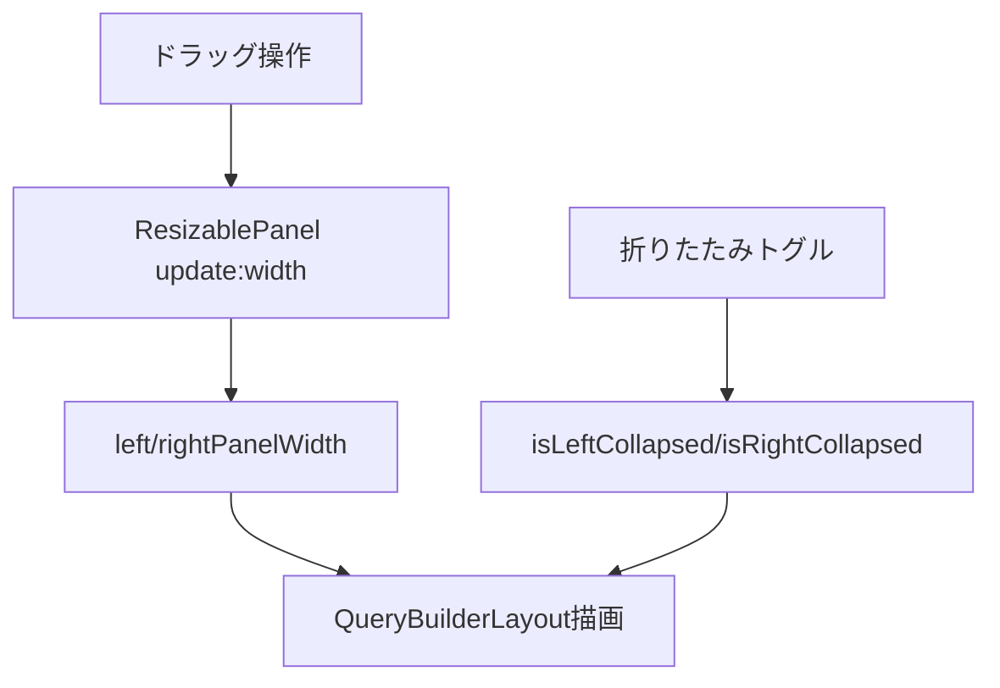

# 3.3.2 QueryBuilderLayout.vue

**フェーズ**: 1.5b Phase 3 - サブフェーズ3.3  
**作成日**: 2025-12-12  
**工数**: 1.5日

---

## 目的

クエリビルダーの3カラムレイアウトを実装し、リサイズ・折りたたみを備えたキャンバスを提供する。

---

## 実装内容

### ファイル構成

**`app/components/query-builder/QueryBuilderLayout.vue`**

### レイアウト仕様

- 左: データベース構造（ツリー/テーブル一覧）
- 中央: クエリキャンバス（テーブル配置・リレーション線）
- 右: SQLプレビュー/条件ビルダー/クエリ情報
- リサイズ: 左右パネルをドラッグで幅調整（min/maxあり）
- 折りたたみ: 左右パネルを最小幅までドラッグ、またはトグルボタンで閉じる（Phase 3.3簡易、4でキーボード対応）

### 実装コード

```vue
<script setup lang="ts">
const MIN_LEFT = 220
const MAX_LEFT = 420
const MIN_RIGHT = 320
const MAX_RIGHT = 620

const leftPanelWidth = ref(260)
const rightPanelWidth = ref(360)
const isLeftCollapsed = ref(false)
const isRightCollapsed = ref(false)

const toggleLeft = () => {
  isLeftCollapsed.value = !isLeftCollapsed.value
  if (!isLeftCollapsed.value && leftPanelWidth.value < MIN_LEFT) {
    leftPanelWidth.value = MIN_LEFT
  }
}

const toggleRight = () => {
  isRightCollapsed.value = !isRightCollapsed.value
  if (!isRightCollapsed.value && rightPanelWidth.value < MIN_RIGHT) {
    rightPanelWidth.value = MIN_RIGHT
  }
}
</script>

<template>
  <div class="flex h-full overflow-hidden bg-gray-50 dark:bg-gray-900">
    <ResizablePanel
      v-if="!isLeftCollapsed"
      v-model:width="leftPanelWidth"
      :min-width="MIN_LEFT"
      :max-width="MAX_LEFT"
      direction="right"
      class="border-r border-gray-200 dark:border-gray-800 bg-white dark:bg-gray-950"
    >
      <DatabaseStructurePanel @toggle="toggleLeft" />
    </ResizablePanel>

    <div v-else class="flex items-center border-r border-gray-200 dark:border-gray-800 bg-white/60 dark:bg-gray-950/60">
      <UButton icon="i-heroicons-chevron-right" variant="ghost" size="xs" @click="toggleLeft" />
    </div>

    <div class="flex-1 min-w-0 bg-slate-50/60 dark:bg-gray-900">
      <QueryCanvasPanel />
    </div>

    <ResizablePanel
      v-if="!isRightCollapsed"
      v-model:width="rightPanelWidth"
      :min-width="MIN_RIGHT"
      :max-width="MAX_RIGHT"
      direction="left"
      class="border-l border-gray-200 dark:border-gray-800 bg-white dark:bg-gray-950"
    >
      <QuerySidebarPanel @toggle="toggleRight" />
    </ResizablePanel>

    <div v-else class="flex items-center border-l border-gray-200 dark:border-gray-800 bg-white/60 dark:bg-gray-950/60">
      <UButton icon="i-heroicons-chevron-left" variant="ghost" size="xs" @click="toggleRight" />
    </div>
  </div>
</template>
```

---

## パネル幅仕様

| パネル | デフォルト | 最小 | 最大 | 備考 |
|-------|----------|------|------|------|
| 左 | 260px | 220px | 420px | DB構造ツリー |
| 中央 | 自動 | - | - | 残り幅を使用 |
| 右 | 360px | 320px | 620px | SQL/条件/情報 |

- 折りたたみ: トグル時はパネル非表示 + 1カラム分のハンドルのみ表示
- リサイズ: `ResizablePanel` が clamp し、中央が自動調整

---

## ResizablePanel 仕様（共通コンポーネント）

### Props

```typescript
interface ResizablePanelProps {
  width: number             // v-model:width
  minWidth: number          // 最小幅
  maxWidth: number          // 最大幅
  direction: 'left' | 'right' // ハンドル位置
}
```

### 振る舞い

- マウスドラッグで幅更新し、`update:width` をemit
- ハンドル幅: 4px（ヒットエリア拡張）、ホバーで色変化
- ドラッグ中は `user-select: none` でテキスト選択を防止
- ハンドルはスクロールに追従するため `absolute` で上下0固定

### サンプルCSS

```vue
<div
  :class="[
    'absolute top-0 bottom-0 w-1 cursor-col-resize',
    'hover:bg-primary-400/60 transition-colors',
    direction === 'right' ? 'right-0' : 'left-0'
  ]"
  @mousedown="startResize"
/>
```

---

## 使用コンポーネント

- `ResizablePanel`（3.3で実装）
- `DatabaseStructurePanel`（左: DB構造/テーブル/カラム、3.3以降）
- `QueryCanvasPanel`（中央: キャンバス/リレーション、3.3以降）
- `QuerySidebarPanel`（右: SQLプレビュー/条件ビルダー/クエリ情報、3.3以降）
- `UButton`（折りたたみトグル、Nuxt UI）

---

## 状態・ロジック

- ローカル状態: `leftPanelWidth`, `rightPanelWidth`, `isLeftCollapsed`, `isRightCollapsed`
- 永続化（Phase 4）: Tauri Store または `useSettingsStore` 経由で幅を保存/復元
- アクセシビリティ: ハンドルはキーボード操作対応をPhase 4で追加（ArrowLeft/Rightで+/-16px）

---

## データフロー



---

## 成果物

- [ ] `app/components/query-builder/QueryBuilderLayout.vue`
- [ ] `app/components/common/ResizablePanel.vue`

---

## 動作確認項目

- [ ] 左右パネルがドラッグでリサイズでき、中央が追従する
- [ ] 最小/最大幅を超えてリサイズされない
- [ ] 左右パネルをトグルで折りたためる
- [ ] 折りたたみ後、トグルで元の幅に復元される
- [ ] レイアウトが高さ全体にフィットし、スクロール時にハンドルがずれない

---

## 依存関係

**前提条件**:
- ✅ Nuxt UI（UButton）使用可
- ✅ QueryBuilderページ（3.3.1）から埋め込み可能

**次のステップ**:
- DatabaseStructurePanel / QueryCanvasPanel / QuerySidebarPanel の実装
- リサイズ幅の永続化（Phase 4）

---

## 備考

- ハンドルのヒットエリアは視覚幅より広げ、UXを確保する
- 背景色はランチャー/設定ページと同系のグレー基調に合わせる
