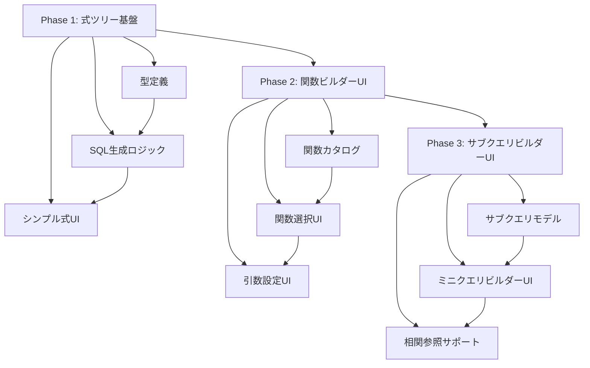

# 実装計画書: SELECT句拡張（関数・サブクエリ対応）

**プロジェクト名**: SELECT句拡張プロジェクト
**プロジェクトコード**: select-clause-extension
**作成日**: 2026-01-02
**最終更新**: 2026-01-02
**ステータス**: 📝 計画中

---

## 1. 実装の優先順位と順序

### 1.1 実装戦略

本プロジェクトは**段階的漸進的アプローチ**を採用し、以下の原則に基づいて実装を進める：

1. **基盤優先**: 型定義とSQL生成ロジックを最初に確立
2. **価値提供の早期化**: 各フェーズで実用的な価値を提供
3. **リスク軽減**: 複雑な機能（サブクエリ）は後半に配置
4. **後方互換性維持**: 既存機能を破壊しない漸進的な拡張

### 1.2 フェーズ別優先順位

| フェーズ | 優先度 | 理由 | リスク |
|---------|-------|------|--------|
| **Phase 1: 式ツリー基盤** | P0（最優先） | すべての後続フェーズの基盤となる | 高：型設計の失敗は全体に影響 |
| **Phase 2: 関数ビルダーUI** | P1（高） | 実用的な価値が高く、ユーザーニーズが大きい | 中：UIの複雑化 |
| **Phase 3: サブクエリビルダーUI** | P2（中） | 高度な機能、Phase 2完了後に実装 | 高：バリデーション・相関参照の実装複雑度 |

### 1.3 実装順序と依存関係



---

## 2. 段階的リリース計画

### 2.1 Phase 1リリース: 式ツリー基盤構築

**目標**: 式ツリー型定義とバックエンドSQL生成を完成させ、文字列形式での式入力を可能にする

#### リリース内容

| 機能 | 内容 | ユーザー価値 |
|-----|------|-----------|
| ExpressionNode型定義 | TypeScript + Rustで整合性のある再帰型定義 | 開発基盤の確立 |
| SQL生成エンジン | 式ツリーからSQLへの変換ロジック | 関数・サブクエリのSQL生成が可能 |
| データベース方言対応 | PostgreSQL, MySQL, SQLiteの関数名マッピング | DB互換性の確保 |
| シンプル式入力UI | テキスト入力で式を直接記述可能 | パワーユーザー向けの柔軟性 |

#### 提供機能例

```typescript
// ユーザーが以下の式を文字列で入力できる
"UPPER(users.name)"
"CONCAT(first_name, ' ', last_name)"
"(SELECT COUNT(*) FROM orders WHERE user_id = users.id)"
```

#### リリース判定基準

- [ ] ExpressionNode型がTypeScript/Rustで定義されている
- [ ] 10種類以上の主要関数でSQL生成が正しく動作する
- [ ] PostgreSQL, MySQL, SQLiteでテストが通過する
- [ ] 既存のクエリビルダー機能が正常動作する（リグレッションテスト）
- [ ] 単体テストカバレッジ80%以上
- [ ] ドキュメントが更新されている

#### 想定期間

- **実装**: 2-3週間
- **テスト**: 1週間
- **ドキュメント更新**: 2日

---

### 2.2 Phase 2リリース: 関数ビルダーUI

**目標**: GUIで直感的に関数を構築できるようにし、ユーザビリティを大幅に向上させる

#### リリース内容

| 機能 | 内容 | ユーザー価値 |
|-----|------|-----------|
| 関数カタログ | カテゴリ別（文字列/日付/数値/条件）の関数一覧 | 使える関数が一覧で分かる |
| 関数選択UI | セレクトボックスで関数を選択 | SQLを暗記する必要がない |
| 引数設定UI | 引数をGUIで設定（カラム/リテラル値/関数） | 式を簡単に構築できる |
| ネスト関数ビルダー | 関数の引数として関数を設定可能 | 複雑な式をGUIで構築可能 |
| プレビュー表示 | 構築中の式をSQL形式でリアルタイム表示 | 生成されるSQLを確認できる |

#### 提供機能例

```
1. 「文字列」カテゴリを選択
2. 「UPPER」関数を選択
3. 引数1にカラム「users.name」を選択
4. プレビューに「UPPER(users.name)」が表示される
```

#### リリース判定基準

- [ ] 20種類以上の関数がカタログに登録されている
- [ ] 各関数カテゴリ（文字列/日付/数値/条件）のUIが完成している
- [ ] ネストした関数（深さ3レベル）が構築できる
- [ ] プレビューがリアルタイム（1秒以内）で更新される
- [ ] UIのユーザビリティテストで80%以上の満足度
- [ ] 単体テストカバレッジ80%以上
- [ ] E2Eテストで主要シナリオがカバーされている

#### 想定期間

- **実装**: 3-4週間
- **テスト**: 1-2週間
- **ユーザビリティテスト**: 3日
- **ドキュメント更新**: 2日

---

### 2.3 Phase 3リリース: サブクエリビルダーUI

**目標**: スカラーサブクエリをGUIで構築できるようにし、関連データの集計機能を提供する

#### リリース内容

| 機能 | 内容 | ユーザー価値 |
|-----|------|-----------|
| サブクエリモデル | スカラーサブクエリの型定義とバリデーション | サブクエリが型安全に扱える |
| ミニクエリビルダーUI | サブクエリ専用の簡易クエリビルダー | GUIでサブクエリを構築できる |
| 相関サブクエリサポート | 外部クエリのカラムを参照可能 | 関連レコード数などが取得できる |
| サブクエリバリデーション | スカラー値を返すかのチェック | エラーを事前に防げる |
| 集計関数サポート | COUNT, SUM, MAX等をサブクエリ内で使用可能 | 集計値を計算カラムとして取得 |

#### 提供機能例

```
1. 「サブクエリ」を選択
2. FROM句で「orders」テーブルを選択
3. SELECT句で「COUNT(*)」を選択
4. WHERE句で「orders.user_id = users.id」を設定
5. プレビューに「(SELECT COUNT(*) FROM orders WHERE user_id = users.id)」が表示される
```

#### リリース判定基準

- [ ] スカラーサブクエリが正しく構築できる
- [ ] 相関サブクエリが正しく動作する
- [ ] サブクエリのバリデーションが動作する（複数行を返すクエリを検出）
- [ ] PostgreSQL, MySQL, SQLiteでテストが通過する
- [ ] 単体テストカバレッジ80%以上
- [ ] E2Eテストで主要シナリオがカバーされている
- [ ] ドキュメントが更新されている

#### 想定期間

- **実装**: 4-5週間
- **テスト**: 2週間
- **ドキュメント更新**: 3日

---

## 3. リスク管理計画

### 3.1 技術リスク

| ID | リスク | 影響度 | 発生確率 | 対策（予防） | 対策（発生時） |
|----|-------|-------|---------|------------|------------|
| **TR-1** | 再帰的な型定義の実装が複雑で予定より時間がかかる | 高 | 中 | 既存のWhereClauseの実装を参考にする。プロトタイプで事前検証する | Phase 1の期間を延長。型設計を簡略化する |
| **TR-2** | データベース方言の違いが想定以上に大きい | 中 | 高 | 主要関数のみサポート。マッピングテーブルを早期に作成 | サポート関数を絞る。DB固有関数は文字列入力で対応 |
| **TR-3** | サブクエリのバリデーションが困難（実行前に判定不可） | 中 | 中 | 基本的なバリデーションに留める。実行時エラーを適切にハンドリング | バリデーションを簡略化。エラーメッセージを改善 |
| **TR-4** | UIの複雑化によるパフォーマンス劣化 | 中 | 中 | プレビュー更新を最適化（デバウンス、メモ化） | UIの一部を遅延ロードに変更。プレビューを簡略化 |
| **TR-5** | ネストした式の深さ制限がユーザーに不便 | 低 | 中 | 深さ10レベルを確保（実用上十分） | 深さ制限を緩和（15レベルに拡張） |
| **TR-6** | 既存型との互換性維持が困難 | 高 | 低 | 新旧型を並行運用。段階的移行パスを設計 | 互換性レイヤーを追加。移行期間を延長 |

### 3.2 プロジェクトリスク

| ID | リスク | 影響度 | 発生確率 | 対策（予防） | 対策（発生時） |
|----|-------|-------|---------|------------|------------|
| **PR-1** | スコープクリープ（ウィンドウ関数、CTEなど追加要望） | 中 | 高 | スコープを明確に文書化。対象外機能リストを明示 | 追加要望はPhase 4以降に延期。プロジェクトゴールを再確認 |
| **PR-2** | 後方互換性の破壊でユーザーの既存クエリが動作しなくなる | 高 | 低 | 既存型を残す。新旧型の共存期間を設ける | ロールバック実施。互換性レイヤーを緊急実装 |
| **PR-3** | パフォーマンス劣化でユーザー体験が悪化 | 中 | 中 | 各フェーズでパフォーマンステスト実施 | ボトルネックを特定し最適化。最悪の場合は機能を簡略化 |
| **PR-4** | ユーザビリティテストで大幅な修正が必要になる | 中 | 中 | 早期にUIプロトタイプを作成し検証 | UIデザインを修正。必要に応じてPhase 2を再実装 |
| **PR-5** | ドキュメント更新が遅れ、開発チームの認識齟齬が発生 | 中 | 中 | 実装と同時にドキュメント更新。レビュープロセスに組み込む | ドキュメント更新タスクを優先。一時的に開発を停止 |

### 3.3 リスク監視計画

| 監視項目 | 指標 | 閾値 | 監視頻度 | 対応者 |
|---------|------|------|---------|--------|
| 実装進捗 | タスク完了率 | 計画比80%以下 | 週次 | 開発者 |
| テストカバレッジ | 単体テストカバレッジ | 80%未満 | PR毎 | 開発者 |
| パフォーマンス | プレビュー更新時間 | 1秒超過 | フェーズ完了時 | 開発者 |
| 後方互換性 | リグレッションテスト失敗数 | 1件以上 | PR毎 | 開発者 |
| ドキュメント整合性 | コードとドキュメントの差分 | 1週間以上遅延 | 週次 | 開発者 |

---

## 4. 品質保証計画

### 4.1 テスト戦略

#### 4.1.1 テストピラミッド

```
            /\
           /E2E\         10% - ユーザーシナリオ全体
          /------\
         /統合テスト\      20% - バックエンド・フロントエンド連携
        /----------\
       /  単体テスト  \    70% - 個別関数・メソッド
      /--------------\
```

#### 4.1.2 テスト種別と責任範囲

| テスト種別 | 対象 | タイミング | ツール | 責任者 |
|----------|------|----------|--------|--------|
| **単体テスト** | 各関数、メソッド、コンポーネント | コード実装時（PR前） | Vitest, @vue/test-utils | 開発者 |
| **統合テスト** | バックエンド・フロントエンド連携、SQL生成→実行 | フェーズ完了時 | Vitest, Tauri Test | 開発者 |
| **E2Eテスト** | ユーザーシナリオ全体（UI→SQL生成→実行→結果表示） | フェーズ完了時 | Playwright or Cypress | 開発者 |
| **リグレッションテスト** | 既存機能の動作確認（後方互換性） | 各フェーズ完了時、PR前 | Vitest, E2Eツール | 開発者 |
| **パフォーマンステスト** | UIレスポンス時間、SQL生成時間 | フェーズ完了時 | Chrome DevTools, Vitest | 開発者 |
| **ユーザビリティテスト** | UIの直感性、操作性 | Phase 2完了時 | 手動テスト | ユーザー + 開発者 |

### 4.2 カバレッジ目標

| フェーズ | 単体テストカバレッジ | 統合テストカバレッジ | E2Eシナリオ数 |
|---------|-------------------|-------------------|--------------|
| Phase 1 | 80%以上 | 60%以上 | 5シナリオ以上 |
| Phase 2 | 80%以上 | 70%以上 | 10シナリオ以上 |
| Phase 3 | 80%以上 | 80%以上 | 15シナリオ以上 |

#### カバレッジ計測対象

- **単体テスト**: すべてのTypeScript/Rustコード（UI除く）
- **統合テスト**: バックエンド・フロントエンド間のAPI呼び出し
- **E2E**: 主要ユーザーシナリオ（代表的な操作フロー）

### 4.3 テストケース設計

#### 4.3.1 Phase 1テストケース

| カテゴリ | テストケース例 | 優先度 |
|---------|--------------|--------|
| 型定義 | ExpressionNodeの各種バリアントが正しく定義されている | P0 |
| SQL生成 | `UPPER(users.name)`が正しくSQLに変換される | P0 |
| SQL生成 | `CONCAT(first_name, ' ', last_name)`が正しく変換される | P0 |
| SQL生成 | ネストした関数が正しく括弧付きで生成される | P0 |
| DB方言 | PostgreSQLで`CONCAT()`が正しく動作する | P0 |
| DB方言 | MySQLで`CONCAT()`が正しく動作する | P0 |
| DB方言 | SQLiteで`CONCAT()`が`||`に変換される | P0 |
| バリデーション | 式ツリーの深さが10レベルを超えるとエラー | P1 |
| 後方互換性 | 既存の`expression`型のクエリが正常動作する | P0 |
| 後方互換性 | 既存の`aggregate`型のクエリが正常動作する | P0 |

#### 4.3.2 Phase 2テストケース

| カテゴリ | テストケース例 | 優先度 |
|---------|--------------|--------|
| UI | 関数カテゴリが4つ（文字列/日付/数値/条件）表示される | P0 |
| UI | 関数を選択すると引数入力UIが表示される | P0 |
| UI | 引数にカラムを選択できる | P0 |
| UI | 引数にリテラル値を入力できる | P0 |
| UI | 引数に関数を選択できる（ネスト） | P0 |
| プレビュー | 関数構築中にプレビューがリアルタイム更新される | P0 |
| プレビュー | プレビュー更新が1秒以内に完了する | P1 |
| E2E | 文字列関数でクエリを構築→実行→結果が正しい | P0 |
| E2E | 日付関数でクエリを構築→実行→結果が正しい | P0 |

#### 4.3.3 Phase 3テストケース

| カテゴリ | テストケース例 | 優先度 |
|---------|--------------|--------|
| UI | サブクエリビルダーが表示される | P0 |
| UI | サブクエリでFROM句のテーブルを選択できる | P0 |
| UI | サブクエリでWHERE句の条件を設定できる | P0 |
| 相関サブクエリ | 外部クエリのカラムを参照できる | P0 |
| バリデーション | 複数行を返すサブクエリでエラーが表示される | P1 |
| SQL生成 | サブクエリが括弧付きで正しく生成される | P0 |
| E2E | 相関サブクエリでクエリを構築→実行→結果が正しい | P0 |

### 4.4 品質ゲート

各フェーズ完了時に以下の品質ゲートを通過する必要がある：

| ゲート項目 | 基準 | 確認方法 |
|-----------|------|---------|
| 単体テストカバレッジ | 80%以上 | CIで自動チェック |
| 単体テスト成功率 | 100%（0件失敗） | CIで自動チェック |
| 統合テスト成功率 | 100%（0件失敗） | CIで自動チェック |
| E2Eテスト成功率 | 100%（0件失敗） | CIで自動チェック |
| リグレッションテスト | 0件失敗 | CIで自動チェック |
| パフォーマンス | プレビュー更新1秒以内 | 手動計測 |
| コードレビュー | すべてのPRで承認 | GitHubレビュー |
| ドキュメント更新 | 永続化ドキュメントが最新 | 手動確認 |

---

## 5. 後方互換性の保証方法

### 5.1 互換性戦略

本プロジェクトでは**新旧型の並行運用**と**段階的移行**により後方互換性を保証する。

#### 5.1.1 既存型の維持

既存の`SelectColumn`型を維持し、新しい`ExpressionNode`型と共存させる：

```typescript
// 既存型（維持）
type SelectColumn = {
  type: 'column' | 'expression' | 'aggregate';
  table?: string;
  column: string;
  alias?: string;
  // ...
};

// 新型（追加）
type ExpressionSelectColumn = {
  type: 'expression_v2';
  expression: ExpressionNode;
  alias?: string;
};

// 統合型
type SelectColumnUnion = SelectColumn | ExpressionSelectColumn;
```

#### 5.1.2 自動移行ロジック

既存のクエリを新型に自動変換するロジックを提供：

```typescript
function migrateSelectColumn(old: SelectColumn): ExpressionSelectColumn {
  // 既存型 → 新型への変換ロジック
  // 例: { type: 'column', table: 'users', column: 'name' }
  //  → { type: 'expression_v2', expression: { type: 'ColumnReference', table: 'users', column: 'name' } }
}
```

### 5.2 段階的移行パス

| 段階 | タイミング | 内容 |
|-----|----------|------|
| **Phase 1** | 式ツリー基盤完成時 | 新型を追加、既存型は維持 |
| **Phase 2** | 関数ビルダーUI完成時 | 新型の使用を推奨、既存型も動作 |
| **Phase 3** | サブクエリビルダーUI完成時 | 新型の使用を推奨、既存型も動作 |
| **Phase 4以降** | TBD | 既存型の非推奨化を検討（最低6ヶ月は維持） |

### 5.3 互換性テスト

| テストケース | 内容 | 実施タイミング |
|------------|------|--------------|
| 既存クエリの動作確認 | 既存の`column`, `expression`, `aggregate`型のクエリが正常動作する | 各フェーズ完了時 |
| 新旧型の混在 | 同一クエリ内で新旧型が混在しても正常動作する | Phase 1完了時 |
| 自動移行 | 既存型が新型に正しく変換される | Phase 1完了時 |
| UI互換性 | 既存のクエリビルダーUIが正常動作する | 各フェーズ完了時 |

### 5.4 非推奨化計画（Phase 4以降）

既存型を非推奨化する場合、以下のプロセスを経る：

1. **告知期間**: 6ヶ月前に非推奨化を告知
2. **警告表示**: UIで既存型使用時に警告を表示
3. **移行支援**: 自動変換ツールを提供
4. **段階的制限**: 新機能では新型のみサポート
5. **完全廃止**: 最低12ヶ月後に既存型のサポートを終了

---

## 6. ドキュメント更新計画

### 6.1 永続化ドキュメントの更新タイミング

| ドキュメント | 更新タイミング | 担当 | レビュー |
|------------|--------------|------|---------|
| **01_product_requirements.md** | Phase 1完了時：SELECT句の要件を更新<br>Phase 2完了時：関数機能の詳細を追加<br>Phase 3完了時：サブクエリ機能の詳細を追加 | 開発者 | レビュアー |
| **02_functional_design.md** | 各フェーズ完了時：画面仕様・機能詳細を更新 | 開発者 | レビュアー |
| **03_architecture_specifications.md** | Phase 1完了時：型定義・アーキテクチャを更新 | 開発者 | レビュアー |
| **04_repository_structure.md** | 新ディレクトリ/ファイル追加時：構造を更新 | 開発者 | レビュアー |
| **05_development_guidelines.md** | 新コーディング規約追加時：ガイドラインを更新 | 開発者 | レビュアー |
| **06_ubiquitous_language.md** | 新用語追加時：用語定義を更新 | 開発者 | レビュアー |
| **features/query-builder.md** | 各フェーズ完了時：機能詳細を更新 | 開発者 | レビュアー |

### 6.2 ドキュメント更新チェックリスト

#### Phase 1完了時

- [ ] `03_architecture_specifications.md`: ExpressionNode型定義を追加
- [ ] `03_architecture_specifications.md`: SQL生成ロジックを追加
- [ ] `06_ubiquitous_language.md`: 式ツリー、ExpressionNode等の用語を追加
- [ ] `features/query-builder.md`: 式入力機能を追加
- [ ] `CHANGELOG.md`: Phase 1の変更内容を記載

#### Phase 2完了時

- [ ] `01_product_requirements.md`: 関数機能の要件を追加
- [ ] `02_functional_design.md`: 関数ビルダーUIの画面仕様を追加
- [ ] `features/query-builder.md`: 関数ビルダー機能を詳細に記載
- [ ] `CHANGELOG.md`: Phase 2の変更内容を記載

#### Phase 3完了時

- [ ] `01_product_requirements.md`: サブクエリ機能の要件を追加
- [ ] `02_functional_design.md`: サブクエリビルダーUIの画面仕様を追加
- [ ] `features/query-builder.md`: サブクエリビルダー機能を詳細に記載
- [ ] `CHANGELOG.md`: Phase 3の変更内容を記載

### 6.3 ドキュメント品質基準

| 基準 | 内容 |
|-----|------|
| 整合性 | コードとドキュメントの内容が一致している |
| 完全性 | すべての機能がドキュメント化されている |
| 明瞭性 | 第三者が読んで理解できる |
| 最新性 | 1週間以上遅延していない |

### 6.4 ドキュメントレビュープロセス

1. **実装者**: コード実装と同時にドキュメントを更新
2. **PR作成**: コードとドキュメントを同一PRで提出
3. **レビュアー**: コードとドキュメントの両方をレビュー
4. **マージ**: レビュー承認後、同時にマージ

---

## 7. ロールバック計画

### 7.1 ロールバック戦略

各フェーズで問題が発生した場合、以下の段階的ロールバック戦略を採用する：

#### 7.1.1 ロールバックレベル

| レベル | 内容 | 実施条件 | 影響範囲 |
|-------|------|---------|---------|
| **L1: 機能無効化** | 新機能のUIを非表示にする（バックエンドは残す） | 軽度のバグ、UIの問題 | ユーザーは新機能を使用不可、既存機能は正常 |
| **L2: 部分ロールバック** | 特定の機能のみを以前のバージョンに戻す | 中度のバグ、一部機能の致命的問題 | 特定機能のみ以前の状態、他機能は継続 |
| **L3: 完全ロールバック** | フェーズ全体を以前のバージョンに戻す | 重大なバグ、データ破損リスク | フェーズ全体が以前の状態に戻る |

### 7.2 フェーズ別ロールバック計画

#### 7.2.1 Phase 1失敗時のロールバック

| 失敗シナリオ | 影響 | ロールバック内容 | 手順 |
|------------|------|----------------|------|
| 型定義の設計ミス | 高 | L3: Phase 1全体をロールバック | 1. フィーチャーフラグでPhase 1を無効化<br>2. 前のリリースブランチにロールバック<br>3. 型設計を再検討 |
| SQL生成バグ | 高 | L3: Phase 1全体をロールバック | 1. フィーチャーフラグでPhase 1を無効化<br>2. バグを修正<br>3. 再テスト・再リリース |
| 後方互換性破壊 | 高 | L3: Phase 1全体をロールバック | 1. 緊急で互換性レイヤーを実装<br>2. 修正後に再リリース |
| 特定DB方言のバグ | 中 | L2: 該当DBのみ無効化 | 1. 該当DBで新機能を無効化<br>2. バグを修正<br>3. 該当DBのみ再リリース |
| UIバグ | 低 | L1: UIのみ無効化 | 1. UIをフィーチャーフラグで非表示<br>2. バグを修正<br>3. 再リリース |

#### 7.2.2 Phase 2失敗時のロールバック

| 失敗シナリオ | 影響 | ロールバック内容 | 手順 |
|------------|------|----------------|------|
| 関数カタログの設計ミス | 中 | L2: 関数ビルダーUIのみロールバック | 1. UIをフィーチャーフラグで非表示<br>2. Phase 1の文字列入力に戻る<br>3. 設計を修正 |
| パフォーマンス劣化 | 高 | L3: Phase 2全体をロールバック | 1. フィーチャーフラグでPhase 2を無効化<br>2. ボトルネックを特定・修正<br>3. 再リリース |
| ユーザビリティ問題 | 中 | L1: UIを一時的に非表示 | 1. UIデザインを修正<br>2. 再テスト<br>3. 再リリース |

#### 7.2.3 Phase 3失敗時のロールバック

| 失敗シナリオ | 影響 | ロールバック内容 | 手順 |
|------------|------|----------------|------|
| サブクエリバリデーション失敗 | 高 | L3: Phase 3全体をロールバック | 1. サブクエリ機能を無効化<br>2. バリデーションロジックを修正<br>3. 再リリース |
| 相関サブクエリのバグ | 中 | L2: 相関サブクエリのみ無効化 | 1. 相関参照機能を無効化<br>2. 通常のサブクエリは継続<br>3. バグ修正後に再リリース |

### 7.3 ロールバック判断基準

| 基準 | 内容 | ロールバックレベル |
|-----|------|------------------|
| データ破損リスク | SQLインジェクション、データ破損の可能性 | L3（即座） |
| 重大バグ | アプリケーションクラッシュ、機能停止 | L3（即座） |
| セキュリティ問題 | セキュリティ脆弱性の発見 | L3（即座） |
| 後方互換性破壊 | 既存クエリが動作しなくなる | L3（即座） |
| パフォーマンス劣化 | レスポンス時間が3倍以上悪化 | L2-L3（緊急） |
| 中度のバグ | 一部機能が正常動作しない | L1-L2（計画的） |
| 軽度のバグ | UIの表示問題、マイナーな不具合 | L1（修正後リリース） |

### 7.4 ロールバック手順

#### 7.4.1 緊急ロールバック（L3）

1. **検知**: 重大バグ・セキュリティ問題を検知
2. **判断**: ステークホルダーに報告、ロールバック判断（30分以内）
3. **実施**:
   ```bash
   # フィーチャーフラグで無効化
   git checkout main
   git revert <commit-hash>
   git push origin main
   ```
4. **確認**: リグレッションテストで既存機能が正常動作することを確認
5. **告知**: ユーザーに状況を報告
6. **原因分析**: 問題の原因を特定
7. **修正**: バグ修正
8. **再テスト**: 修正版を徹底的にテスト
9. **再リリース**: 修正版をリリース

#### 7.4.2 計画的ロールバック（L1-L2）

1. **検知**: 中度・軽度のバグを検知
2. **分析**: 影響範囲を分析（1-2日）
3. **計画**: ロールバック・修正計画を作成
4. **実施**: フィーチャーフラグで該当機能を無効化
5. **修正**: バグ修正
6. **テスト**: 修正版をテスト
7. **リリース**: 修正版をリリース

### 7.5 フィーチャーフラグ設計

各フェーズの機能をフィーチャーフラグで制御可能にする：

```typescript
// フィーチャーフラグ例
const featureFlags = {
  expressionTreeEnabled: true,   // Phase 1: 式ツリー基盤
  functionBuilderEnabled: true,  // Phase 2: 関数ビルダーUI
  subqueryBuilderEnabled: true,  // Phase 3: サブクエリビルダーUI

  // 詳細な制御
  correlatedSubqueryEnabled: true,  // 相関サブクエリ
  nestedFunctionDepth: 10,          // ネストの深さ制限
};
```

### 7.6 ロールバック後の対応

| 対応項目 | 内容 | 担当 |
|---------|------|------|
| 原因分析 | ロールバックの原因を詳細に分析 | 開発者 |
| ポストモーテム | 問題の根本原因、再発防止策を文書化 | 開発者 + レビュアー |
| プロセス改善 | テストプロセス、レビュープロセスを改善 | 開発者 + レビュアー |
| ユーザーコミュニケーション | 問題の説明、修正予定を告知 | プロダクトオーナー |
| 再発防止 | 同様の問題を検知する仕組みを追加 | 開発者 |

---

## 8. 変更管理

### 8.1 変更履歴

| 日付 | バージョン | 変更内容 | 変更者 |
|------|----------|---------|--------|
| 2026-01-02 | 1.0 | 初版作成 | Claude |

---

## 関連ドキュメント

- [プロジェクト計画書](project-plan.md)
- [要件定義書](requirements.md)
- [技術設計書](design.md)
- [WBS](wbs.md)
