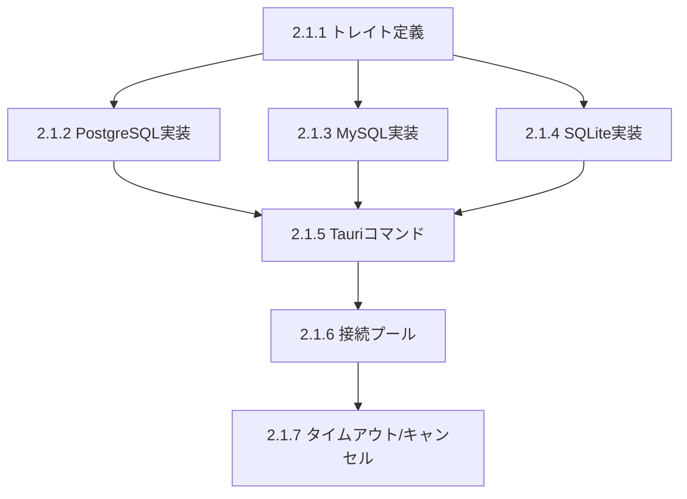

# タスクリスト: クエリ実行基盤（Rust）

## 進捗サマリー

| 状態 | 数 |
|------|-----|
| 完了 | 15 |
| 進行中 | 0 |
| 未着手 | 0 |

## タスク一覧

### 2.1.1 QueryExecutor トレイト定義

| ID | タスク | 状態 | 備考 |
|----|--------|------|------|
| 2.1.1-1 | QueryResult型定義（`models/query_result.rs`） | ✅ 完了 | |
| 2.1.1-2 | QueryError型定義 | ✅ 完了 | |
| 2.1.1-3 | QueryExecutorトレイト定義（`services/query_executor.rs`） | ✅ 完了 | |
| 2.1.1-4 | QueryExecutorFactoryの実装 | ✅ 完了 | |

**完了条件**: 各DB共通のクエリ実行インターフェース定義 ✅

### 2.1.2 PostgreSQL QueryExecutor実装

| ID | タスク | 状態 | 備考 |
|----|--------|------|------|
| 2.1.2-1 | PostgresExecutor構造体の作成 | ✅ 完了 | |
| 2.1.2-2 | execute()メソッドの実装 | ✅ 完了 | |
| 2.1.2-3 | 値型変換（PgRow → QueryValue）の実装 | ✅ 完了 | |

**完了条件**: PostgreSQLでSELECT実行可能 ✅

### 2.1.3 MySQL QueryExecutor実装

| ID | タスク | 状態 | 備考 |
|----|--------|------|------|
| 2.1.3-1 | MysqlExecutorの実装 | ✅ 完了 | PostgresExecutorを参考 |

**完了条件**: MySQLでSELECT実行可能 ✅

### 2.1.4 SQLite QueryExecutor実装

| ID | タスク | 状態 | 備考 |
|----|--------|------|------|
| 2.1.4-1 | SqliteExecutorの実装 | ✅ 完了 | PostgresExecutorを参考 |

**完了条件**: SQLiteでSELECT実行可能 ✅

### 2.1.5 execute_query Tauriコマンド

| ID | タスク | 状態 | 備考 |
|----|--------|------|------|
| 2.1.5-1 | execute_queryコマンドの実装 | ✅ 完了 | |
| 2.1.5-2 | lib.rsへのコマンド登録 | ✅ 完了 | |

**完了条件**: フロントエンドからクエリ実行可能 ✅

### 2.1.6 接続プール管理

| ID | タスク | 状態 | 備考 |
|----|--------|------|------|
| 2.1.6-1 | ConnectionPoolManagerの実装 | ✅ 完了 | |
| 2.1.6-2 | lib.rsへのマネージャー登録 | ✅ 完了 | |

**完了条件**: 接続の効率的な再利用 ✅

### 2.1.7 タイムアウト・キャンセル機能

| ID | タスク | 状態 | 備考 |
|----|--------|------|------|
| 2.1.7-1 | QueryCancellationManagerの実装 | ✅ 完了 | |
| 2.1.7-2 | cancel_queryコマンドの実装 | ✅ 完了 | |
| 2.1.7-3 | execute_with_timeoutの統合 | ✅ 完了 | |

**完了条件**: 長時間クエリのキャンセル可能 ✅

## 依存関係

## 作業ログ

| 日時 | タスクID | 作業内容 | 担当 |
|------|---------|---------|------|
| 2025-12-29 | 2.1.1-1〜4 | QueryResult/QueryError型、QueryExecutorトレイト、ファクトリ実装 | - |
| 2025-12-29 | 2.1.2-1〜3 | PostgresExecutor実装（型変換含む） | - |
| 2025-12-29 | 2.1.3-1 | MysqlExecutor実装 | - |
| 2025-12-29 | 2.1.4-1 | SqliteExecutor実装 | - |
| 2025-12-29 | 2.1.5-1〜2 | execute_query/cancel_queryコマンド実装、lib.rs登録 | - |
| 2025-12-29 | 2.1.6-1〜2 | ConnectionPoolManager実装、lib.rs登録 | - |
| 2025-12-29 | 2.1.7-1〜3 | QueryCancellationManager実装、タイムアウト統合 | - |

## 凡例

- 📝 未着手
- 🔄 進行中
- ✅ 完了
- ⏸️ 保留
- ❌ 中止

## 実装ファイル一覧

| ファイル | 内容 |
|---------|------|
| `src-tauri/src/models/query_result.rs` | QueryResult, QueryError等の型定義 |
| `src-tauri/src/services/query_executor.rs` | トレイト、ファクトリ、プールマネージャー、キャンセル管理 |
| `src-tauri/src/database/postgresql_executor.rs` | PostgreSQL実装 |
| `src-tauri/src/database/mysql_executor.rs` | MySQL実装 |
| `src-tauri/src/database/sqlite_executor.rs` | SQLite実装 |
| `src-tauri/src/services/query_executor_test.rs` | キャンセル機能のテスト |
| `src-tauri/src/commands/query.rs` | execute_query, cancel_queryコマンド |
| `src-tauri/src/lib.rs` | マネージャー登録、コマンド登録 |

## 次のステップ

Phase 2.1（クエリ実行基盤）の実装が完了しました。

次は **Phase 2.2（結果表示UI）** に進みます：
- フロントエンド側のQueryResult型定義
- queryApi.executeQuery実装
- ResultTable.vueコンポーネント
- ResultPanel.vue拡張
