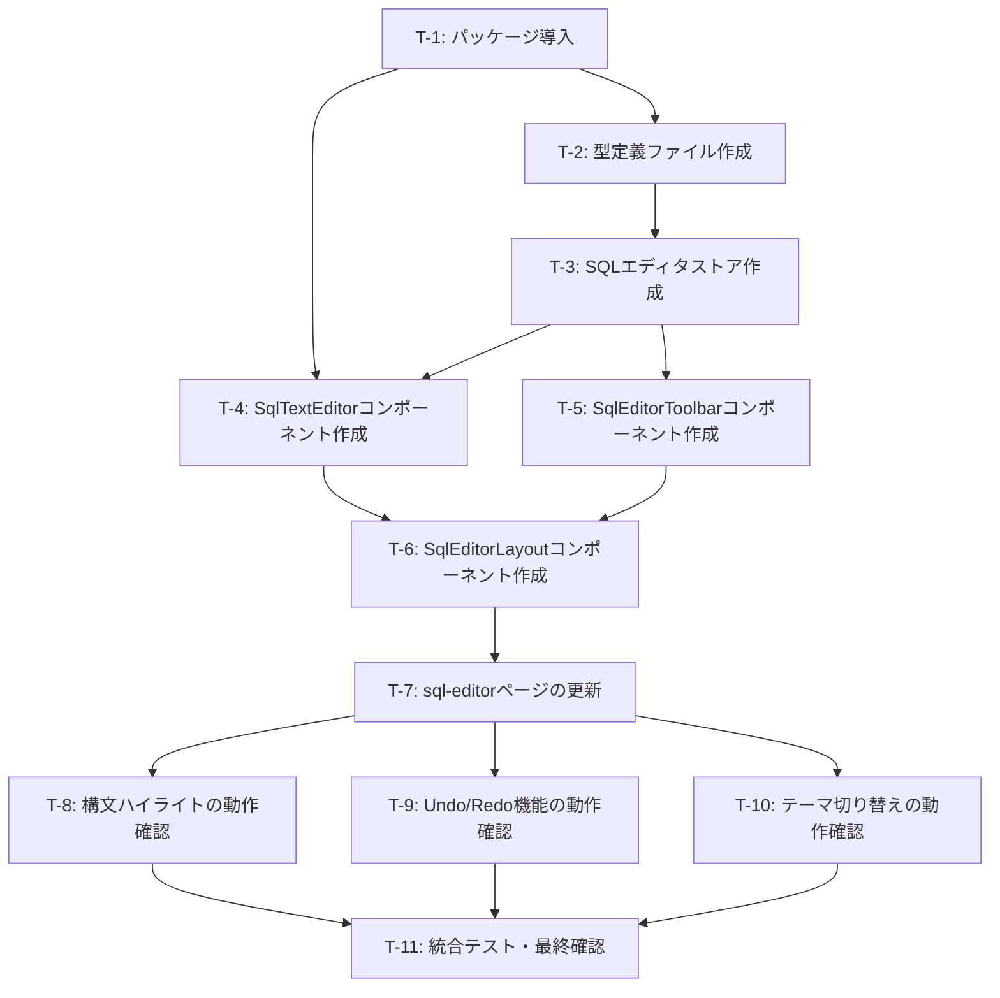

# タスクリスト - SQLエディタ Phase 2: エディタUI基本構築

## 変更履歴

- 2026-01-17: CodeMirror 6からMonaco Editorに変更。見積もり時間を調整（15h → 14.8h）

## 進捗サマリー

| 状態 | 件数 |
|------|------|
| ✅ 完了 | 0 |
| 🚧 進行中 | 0 |
| 📝 未着手 | 11 |

**合計見積**: 14.8h

## タスク一覧

### T-1: パッケージ導入 📝

**見積**: 1h

- [ ] Monaco Editor関連パッケージをインストール
  - `monaco-editor`
  - `vite-plugin-monaco-editor` (devDependencies)
- [ ] `package.json` の更新確認
- [ ] `nuxt.config.ts` にMonaco Editorプラグイン設定を追加
- [ ] `npm install` 実行
- [ ] ビルドエラーがないか確認

**成果物**: `package.json`, `nuxt.config.ts` 更新、`node_modules` にパッケージ追加

**受け入れ条件**:
- [ ] Monaco Editorパッケージがインストールされている
- [ ] `nuxt.config.ts` にViteプラグイン設定が追加されている
- [ ] `npm run dev` が正常に起動する
- [ ] TypeScript型定義が認識される

---

### T-2: 型定義ファイル作成 📝

**見積**: 1h

**関連要件**: F-8

- [ ] `app/types/sql-editor.ts` を作成
- [ ] `SqlEditorState` インターフェースを定義
- [ ] `SqlEditorTab` インターフェースを定義（Phase 6で使用）
- [ ] `MonacoEditorOptions` インターフェースを定義
- [ ] Monaco Editorの型をインポート
- [ ] ユビキタス言語定義書との整合性を確認
- [ ] TypeScript型チェックでエラーがないか確認

**成果物**: `app/types/sql-editor.ts`

**受け入れ条件**:
- [ ] すべてのインターフェースが定義されている
- [ ] Monaco Editorの型が正しくインポートされている
- [ ] TypeScript型チェックがパスする
- [ ] ドキュメントコメント（JSDoc）が記載されている

---

### T-3: SQLエディタストア作成 📝

**見積**: 2h

**関連要件**: F-7

- [ ] `app/stores/sql-editor.ts` を作成
- [ ] `state` を実装（`SqlEditorState` に準拠）
- [ ] `getters` を実装
  - `currentConnection`
  - `canExecute`
- [ ] `actions` を実装
  - `setConnection`
  - `updateSql`
  - `reset`
  - `executeQuery`（スタブ、Phase 3で実装）
- [ ] ユニットテストを作成
- [ ] テスト実行・パス確認

**成果物**: `app/stores/sql-editor.ts`, `tests/stores/sql-editor.test.ts`

**受け入れ条件**:
- [ ] ストアが正しく定義されている
- [ ] すべてのアクションが動作する
- [ ] ユニットテストがパスする
- [ ] TypeScript型チェックがパスする

---

### T-4: SqlTextEditorコンポーネント作成 📝

**見積**: 4h（Monaco Editor統合の複雑性を考慮）

**関連要件**: F-3, F-4, F-5, F-6

- [ ] `app/components/sql-editor/SqlTextEditor.vue` を作成
- [ ] Monaco Editorの初期化ロジックを実装
- [ ] SQL言語サポート（Monaco Editor標準機能）を設定
- [ ] 行番号表示を有効化
- [ ] エディタオプション設定（minimap無効化、wordWrap等）
- [ ] ストアとの連携（SQL更新時にストアを更新）
- [ ] カラーモード切り替え対応（vs / vs-dark）
- [ ] Monaco Editor dispose処理の実装
- [ ] コンポーネントテストを作成
- [ ] 動作確認（手動テスト）

**成果物**: `app/components/sql-editor/SqlTextEditor.vue`, `tests/components/sql-editor/SqlTextEditor.test.ts`

**受け入れ条件**:
- [ ] Monaco Editorが正しく表示される
- [ ] SQLキーワードが構文ハイライトされる
- [ ] 行番号が表示される
- [ ] テキスト入力・削除・コピペが動作する
- [ ] Ctrl+Z（Cmd+Z）でUndoが動作する（Monaco標準機能）
- [ ] Ctrl+Shift+Z（Cmd+Shift+Z）でRedoが動作する（Monaco標準機能）
- [ ] ライト/ダークモード両方で正しく表示される
- [ ] コンポーネント破棄時にMonaco Editorが正しくdisposeされる

---

### T-5: SqlEditorToolbarコンポーネント作成 📝

**見積**: 1.5h

**関連要件**: F-2

- [ ] `app/components/sql-editor/SqlEditorToolbar.vue` を作成
- [ ] 実行ボタンを配置（無効状態）
- [ ] 停止ボタンを配置（無効状態）
- [ ] 保存ボタンを配置（無効状態）
- [ ] Nuxt UI v4の `UButton` コンポーネントを使用
- [ ] アイコンを設定（Heroicons）
- [ ] レスポンシブ対応
- [ ] コンポーネントテストを作成
- [ ] 動作確認（手動テスト）

**成果物**: `app/components/sql-editor/SqlEditorToolbar.vue`, `tests/components/sql-editor/SqlEditorToolbar.test.ts`

**受け入れ条件**:
- [ ] ツールバーが正しく表示される
- [ ] すべてのボタンが無効状態で表示される
- [ ] アイコンが正しく表示される
- [ ] レスポンシブ対応が動作する
- [ ] コンポーネントテストがパスする

---

### T-6: SqlEditorLayoutコンポーネント作成 📝

**見積**: 2h

**関連要件**: F-1

- [ ] `app/components/sql-editor/SqlEditorLayout.vue` を作成
- [ ] ツールバーエリアを配置
- [ ] エディタエリアを配置
- [ ] 結果パネルエリア（プレースホルダー）を配置
- [ ] レスポンシブレイアウト実装
- [ ] 各セクションの高さ調整（flex）
- [ ] `SqlEditorToolbar` を組み込み
- [ ] `SqlTextEditor` を組み込み
- [ ] コンポーネントテストを作成
- [ ] 動作確認（手動テスト）

**成果物**: `app/components/sql-editor/SqlEditorLayout.vue`, `tests/components/sql-editor/SqlEditorLayout.test.ts`

**受け入れ条件**:
- [ ] レイアウトが正しく表示される
- [ ] ツールバー、エディタ、結果パネルの3つのセクションが存在する
- [ ] ウィンドウサイズ変更時にレスポンシブに追従する
- [ ] オーバーフロー時のスクロール動作が正しい
- [ ] コンポーネントテストがパスする

---

### T-7: sql-editorページの更新 📝

**見積**: 1h

**関連要件**: F-9

- [ ] `app/pages/sql-editor.vue` を更新
- [ ] Phase 1の空ページから `SqlEditorLayout` を組み込み
- [ ] ストアの初期化処理を追加
- [ ] 接続情報の取得・設定ロジックを実装
- [ ] `EnvironmentHeader` との連携を確認
- [ ] 動作確認（手動テスト）

**成果物**: `app/pages/sql-editor.vue` 更新

**受け入れ条件**:
- [ ] SQLエディタウィンドウが正しく表示される
- [ ] レイアウトコンポーネントが組み込まれている
- [ ] 接続情報が正しく取得・設定される
- [ ] EnvironmentHeaderに環境が表示される

---

### T-8: 構文ハイライトの動作確認 📝

**見積**: 0.5h（Monaco Editorの標準機能のため確認のみ）

**関連要件**: F-4

- [ ] SQLキーワードのハイライト確認
  - SELECT, FROM, WHERE, JOIN, GROUP BY, ORDER BY, etc.
- [ ] 文字列リテラルのハイライト確認（'...'）
- [ ] コメントのハイライト確認（`--` および `/* */`）
- [ ] 数値のハイライト確認
- [ ] Monaco Editorの標準テーマ（vs / vs-dark）の確認
- [ ] ライトモード/ダークモード両方で確認
- [ ] 複雑なSQLでの動作確認

**成果物**: なし（確認作業）

**受け入れ条件**:
- [ ] Monaco EditorのSQL言語サポートが正しく動作する
- [ ] すべてのSQLキーワードが色分けされる
- [ ] 文字列リテラルが色分けされる
- [ ] コメントが色分けされる
- [ ] ライト/ダークモード両方で適切に表示される

---

### T-9: Undo/Redo機能の動作確認 📝

**見積**: 0.3h（Monaco Editorの標準機能のため確認のみ）

**関連要件**: F-6

- [ ] Ctrl+Z（Cmd+Z）でUndoが動作することを確認
- [ ] Ctrl+Shift+Z（Cmd+Shift+Z）でRedoが動作することを確認
- [ ] 複数回のUndo/Redoが正しく動作することを確認
- [ ] Monaco Editorのデフォルト編集履歴が正しく動作することを確認

**成果物**: なし（確認作業）

**受け入れ条件**:
- [ ] Undoが正しく動作する（Monaco標準機能）
- [ ] Redoが正しく動作する（Monaco標準機能）
- [ ] 編集履歴が適切に管理される

---

### T-10: テーマ切り替えの動作確認 📝

**見積**: 0.5h

**関連要件**: F-3

- [ ] Nuxt UIのカラーモード切り替え時にMonaco Editorのテーマが追従することを確認
- [ ] ライトモードで `vs` テーマが適用されることを確認
- [ ] ダークモードで `vs-dark` テーマが適用されることを確認
- [ ] `monaco.editor.setTheme()` による動的切り替えが動作することを確認
- [ ] テーマ切り替え時の遅延がないか確認
- [ ] エディタ背景色、テキスト色、行番号色の確認

**成果物**: なし（確認作業）

**受け入れ条件**:
- [ ] カラーモード切り替え時にエディタテーマが即座に切り替わる
- [ ] ライトモード（vs）/ダークモード（vs-dark）両方で視認性が良い
- [ ] アプリ全体のデザインと調和している

---

### T-11: 統合テスト・最終確認 📝

**見積**: 1.5h

- [ ] すべてのユニットテストがパスすることを確認
- [ ] すべてのコンポーネントテストがパスすることを確認
- [ ] TypeScript型チェックがパスすることを確認
- [ ] ランチャーからSQLエディタを起動できることを確認
- [ ] 接続情報が正しく渡されることを確認
- [ ] エディタの基本機能が動作することを確認
  - テキスト入力
  - 削除
  - コピー&ペースト
  - Undo/Redo
  - 構文ハイライト
  - 行番号表示
- [ ] レスポンシブ動作の確認
- [ ] ライト/ダークモード切り替えの確認
- [ ] パフォーマンス確認（大きなSQL文での動作、Monaco Editorの初期化時間）
- [ ] 永続化ドキュメントの更新確認
  - 必要に応じて `docs/steering/` 配下のドキュメントを更新

**成果物**: テスト結果レポート、ドキュメント更新

**受け入れ条件**:
- [ ] すべてのテストがパスする
- [ ] 要件定義書の受け入れ条件がすべて満たされている
- [ ] パフォーマンス要件を満たしている
- [ ] 永続化ドキュメントが更新されている（必要に応じて）

---

## 完了条件

- [ ] すべてのタスク（T-1 〜 T-11）が完了
- [ ] 要件定義書の受け入れ条件がすべて満たされている
  - [requirements.md](./requirements.md) を参照
- [ ] 設計書の実装が完了している
  - [design.md](./design.md) を参照
- [ ] すべてのテストがパスしている
- [ ] TypeScript型チェックがパスしている
- [ ] ランチャーからSQLエディタが起動できる
- [ ] エディタでSQLを記述・編集できる
- [ ] 構文ハイライト、行番号、Undo/Redoが動作する
- [ ] ライト/ダークモード両方で正しく表示される
- [ ] 永続化ドキュメントが更新されている（必要に応じて）

## タスク依存関係

## 実装の推奨順序

1. **T-1**: パッケージ導入
2. **T-2**: 型定義ファイル作成
3. **T-3**: SQLエディタストア作成
4. **T-4**: SqlTextEditorコンポーネント作成（最も複雑なコンポーネント）
5. **T-5**: SqlEditorToolbarコンポーネント作成
6. **T-6**: SqlEditorLayoutコンポーネント作成
7. **T-7**: sql-editorページの更新
8. **T-8**: 構文ハイライトの動作確認
9. **T-9**: Undo/Redo機能の動作確認
10. **T-10**: テーマ切り替えの動作確認
11. **T-11**: 統合テスト・最終確認

## 参考情報

### WBS Phase 2のタスク対応表

| WBS タスクID | 本タスクリスト | 対応 |
|-------------|--------------|------|
| P2-1 | T-6 | SqlEditorLayoutコンポーネント作成 |
| P2-2 | T-5 | SqlEditorToolbarコンポーネント作成 |
| P2-3, P2-4, P2-5 | T-4 | SqlTextEditorコンポーネント作成 |
| P2-6 | T-3 | SQLエディタストア作成 |
| P2-7 | T-2 | 型定義ファイル作成 |
| P2-8 | T-7 | sql-editorページの更新 |
| P2-9 | T-8, T-9, T-10, T-11 | 動作確認・テスト |

### 関連ドキュメント

- [requirements.md](./requirements.md) - 要件定義書
- [design.md](./design.md) - 設計書
- [testing.md](./testing.md) - テスト手順書（次のステップで作成）
- [WBS Phase 2](../../local/20260117_エディタ機能/wbs.md#phase-2-エディタui基本構築)
