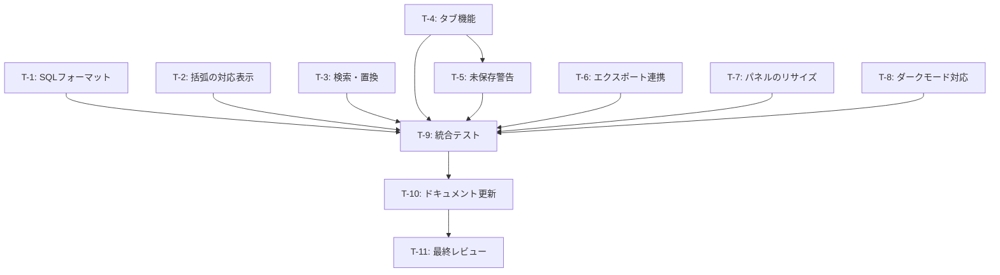

# タスクリスト - SQLエディタ Phase 6: UX改善・仕上げ

## 進捗サマリー

| 状態 | 件数 |
|------|------|
| 完了 | 0 |
| 進行中 | 0 |
| 未着手 | 11 |

**全体進捗**: 0% (0/11)

## タスク一覧

### T-1: SQLフォーマット機能

**見積**: 2h | **優先度**: 高

- [ ] `sql-formatter` パッケージのインストール
- [ ] ストアに `formatSql()` アクション追加
- [ ] ツールバーに「整形」ボタン追加
- [ ] Ctrl/Cmd+Shift+F キーボードショートカット実装
- [ ] フォーマット設定の検討（キーワード大文字/小文字、インデント幅）
- [ ] フォーマットエラー時のハンドリング
- [ ] 動作確認（PostgreSQL/MySQL/SQLite）

**関連要件**: F-1

**成果物**:
- `app/stores/sql-editor.ts` (formatSql アクション追加)
- `app/components/sql-editor/SqlEditorToolbar.vue` (整形ボタン追加)
- `app/components/sql-editor/SqlTextEditor.vue` (ショートカット追加)
- `package.json` (sql-formatter 追加)

---

### T-2: 括弧の対応表示

**見積**: 1.5h | **優先度**: 高

- [ ] Monaco Editorの `matchBrackets` オプションを有効化
- [ ] `bracketPairColorization` オプションを有効化（Monaco Editor v0.33.0+）
- [ ] 動作確認（括弧の対応が正しくハイライトされるか）
- [ ] ライトモード/ダークモードでの視認性確認

**関連要件**: F-2

**成果物**:
- `app/components/sql-editor/SqlTextEditor.vue` (Monaco Editor設定拡張)

---

### T-3: 検索・置換機能

**見積**: 2h | **優先度**: 高

- [ ] Monaco Editorの検索・置換UIが正しく動作することを確認
- [ ] `find` オプションの設定（seedSearchStringFromSelection等）
- [ ] Ctrl/Cmd+F で検索ダイアログが表示されることを確認
- [ ] Ctrl/Cmd+H で置換ダイアログが表示されることを確認
- [ ] 正規表現検索の動作確認
- [ ] 大文字小文字区別の動作確認
- [ ] ドキュメント・ヘルプの記載

**関連要件**: F-3

**成果物**:
- `app/components/sql-editor/SqlTextEditor.vue` (Monaco Editor設定拡張)

---

### T-4: タブ機能（複数クエリの同時編集）

**見積**: 3h | **優先度**: 中

- [ ] 型定義追加（`EditorTab` インターフェース）
- [ ] ストア拡張（tabs, activeTabId フィールド追加）
- [ ] ストアにタブ管理アクション追加（addTab, closeTab, switchTab, renameTab）
- [ ] `EditorTabs.vue` コンポーネント作成
- [ ] タブ切り替え時の状態保存・復元ロジック実装
- [ ] タブの名前表示（未保存は「* 」マーク付き）
- [ ] 新規タブボタンの実装
- [ ] タブ閉じるボタンの実装
- [ ] Ctrl/Cmd+N ショートカット実装
- [ ] 動作確認（複数タブの独立性）

**関連要件**: F-4

**成果物**:
- `app/types/sql-editor.ts` (EditorTab 型追加)
- `app/stores/sql-editor.ts` (タブ管理ロジック追加)
- `app/components/sql-editor/EditorTabs.vue` (新規作成)
- `app/components/sql-editor/SqlEditorLayout.vue` (EditorTabs 組み込み)

---

### T-5: 未保存警告

**見積**: 1h | **優先度**: 低（T-4完了後）

- [ ] `beforeunload` イベントハンドラー実装
- [ ] タブを閉じる際の確認ダイアログ実装（UModal使用）
- [ ] 「保存」「破棄」「キャンセル」ボタンの実装
- [ ] 保存ダイアログとの連携
- [ ] 動作確認（未保存タブ閉じる、ウィンドウ閉じる）

**関連要件**: F-5

**成果物**:
- `app/pages/sql-editor.vue` (beforeunload イベント追加)
- `app/components/sql-editor/EditorTabs.vue` (確認ダイアログ追加)

---

### T-6: エクスポート連携

**見積**: 1.5h | **優先度**: 中

- [ ] `SqlEditorResultPanel.vue` にエクスポートボタン追加
- [ ] 既存の `ExportDialog` コンポーネントをインポート
- [ ] エクスポートダイアログの表示制御
- [ ] `result` データの受け渡し
- [ ] CSV/JSON/Excel形式のエクスポート動作確認
- [ ] エクスポートファイル名のデフォルト値設定

**関連要件**: F-6

**成果物**:
- `app/components/sql-editor/SqlEditorResultPanel.vue` (エクスポートボタン・ダイアログ追加)

---

### T-7: パネルのリサイズ対応

**見積**: 1.5h | **優先度**: 中

- [ ] リサイズハンドルのUI作成（CSS）
- [ ] マウスダウンイベントでリサイズ開始
- [ ] マウスムーブイベントでリサイズ処理
- [ ] マウスアップイベントでリサイズ終了
- [ ] 最小サイズ制限（20% ~ 80%）
- [ ] リサイズ後のサイズをローカルストレージに保存
- [ ] アプリ起動時にサイズを復元
- [ ] 動作確認（スムーズなリサイズ）

**関連要件**: F-7

**成果物**:
- `app/components/sql-editor/SqlEditorLayout.vue` (リサイズハンドル・ロジック追加)

---

### T-8: ダークモード対応確認

**見積**: 1h | **優先度**: 中

- [ ] Monaco Editorのテーマ設定（vs / vs-dark）
- [ ] `useColorMode()` との連動実装
- [ ] カラーモード変更時のテーマ更新ロジック
- [ ] ライトモードでの視覚確認（全UI要素）
- [ ] ダークモードでの視覚確認（全UI要素）
- [ ] 構文ハイライトの色確認（可読性）
- [ ] 不具合があれば修正

**関連要件**: F-8

**成果物**:
- `app/components/sql-editor/SqlTextEditor.vue` (テーマ連動ロジック追加)

---

### T-9: 統合テスト

**見積**: 3h | **優先度**: 必須

- [ ] SQLフォーマット機能のユニットテスト作成
- [ ] タブ機能のユニットテスト作成（ストア）
- [ ] タブ機能のコンポーネントテスト作成
- [ ] エクスポート機能の動作確認テスト
- [ ] リサイズ機能の手動テスト
- [ ] ダークモード切り替えの手動テスト
- [ ] 全機能の総合動作確認
- [ ] テスト失敗時の修正

**関連要件**: 全て

**成果物**:
- `tests/stores/sql-editor.spec.ts` (フォーマット・タブ機能テスト)
- `tests/components/sql-editor/EditorTabs.spec.ts` (タブUIテスト)
- `tests/components/sql-editor/SqlEditorResultPanel.spec.ts` (エクスポートテスト)

---

### T-10: ドキュメント更新

**見積**: 1h | **優先度**: 必須

- [ ] 永続化ドキュメント更新確認（必要に応じて）
  - `docs/steering/02_functional_design.md` (機能設計書)
  - `docs/steering/features/sql-editor.md` (存在する場合)
- [ ] CLAUDE.md の更新確認（必要に応じて）
- [ ] README.md の更新確認（必要に応じて）
- [ ] 開発作業ドキュメント（本ディレクトリ）の最終更新

**関連要件**: 全て

**成果物**:
- 各種ドキュメント更新

---

### T-11: 最終レビュー・バグ修正

**見積**: 2h | **優先度**: 必須

- [ ] コードレビュー（スタイル、命名規則、ベストプラクティス）
- [ ] パフォーマンス確認（SQLフォーマット1秒以内、検索100ms以内）
- [ ] エッジケースの確認（空SQL、巨大SQL、エラー時の挙動）
- [ ] ユーザビリティ確認（キーボード操作、マウス操作）
- [ ] バグ修正（発見された問題の対応）
- [ ] リファクタリング（必要に応じて）

**関連要件**: 全て

**成果物**:
- 修正・改善されたコード

---

## タスク依存関係

## 推奨実装順序

### ステップ1: Monaco Editor設定拡張（高優先度、工数小）

1. T-2: 括弧の対応表示
2. T-3: 検索・置換機能

### ステップ2: SQLフォーマット（高優先度、独立実装）

3. T-1: SQLフォーマット機能

### ステップ3: 既存資産活用（中優先度、工数小）

4. T-6: エクスポート連携
5. T-8: ダークモード対応

### ステップ4: UX改善（中優先度）

6. T-7: パネルのリサイズ対応

### ステップ5: タブ機能（低優先度、工数大）

7. T-4: タブ機能
8. T-5: 未保存警告

### ステップ6: 仕上げ（必須）

9. T-9: 統合テスト
10. T-10: ドキュメント更新
11. T-11: 最終レビュー・バグ修正

## 完了条件

### 機能要件

- [ ] F-1: SQLフォーマット機能が動作する
- [ ] F-2: 括弧の対応表示が動作する
- [ ] F-3: 検索・置換機能が動作する
- [ ] F-4: タブ機能が動作する（複数クエリの同時編集）
- [ ] F-5: 未保存警告が表示される
- [ ] F-6: エクスポート連携が動作する
- [ ] F-7: パネルのリサイズが動作する
- [ ] F-8: ダークモード対応が完了している

### 非機能要件

- [ ] SQLフォーマットが10,000文字のSQLを1秒以内に処理
- [ ] 検索が10,000文字のSQL内で100ms以内に応答
- [ ] タブ切り替えが100ms以内に完了
- [ ] ライトモード/ダークモード両方で視覚的な不具合がゼロ

### 品質要件

- [ ] 全ユニットテストがパス
- [ ] 全統合テストがパス
- [ ] コードレビュー完了
- [ ] 永続化ドキュメントが更新済み

### 成功指標

- [ ] ユーザーが「VSCodeのようなエディタ体験」と感じられる
- [ ] 複数クエリの同時編集がスムーズに行える
- [ ] 未保存データの損失が防止される
- [ ] エクスポート機能がクエリビルダーと同等の使い勝手

## リスク管理

| リスク | 影響度 | 対策 |
|--------|--------|------|
| Monaco Editorの設定が複雑 | 中 | 公式ドキュメント・Playgroundで事前検証 |
| タブ機能の状態管理が複雑化 | 高 | 段階的実装、ユニットテスト充実 |
| SQLフォーマットライブラリの品質 | 中 | 複数ライブラリを比較検討、フォールバック実装 |
| パネルリサイズのパフォーマンス | 低 | requestAnimationFrame で最適化 |
| ダークモード対応の不具合 | 中 | 全UI要素を目視確認、スクリーンショット記録 |

## メモ・備考

- Phase 5完了後に着手
- 各機能は独立性が高いため、優先度をつけて段階的に実装可能
- タブ機能は最も複雑度が高いため、他の機能実装後に着手推奨
- `sql-formatter` 以外の候補: `prettier-plugin-sql`, `pg-formatter` など
- Monaco Editor v0.33.0 以降が必要（括弧のペア色分け機能）
