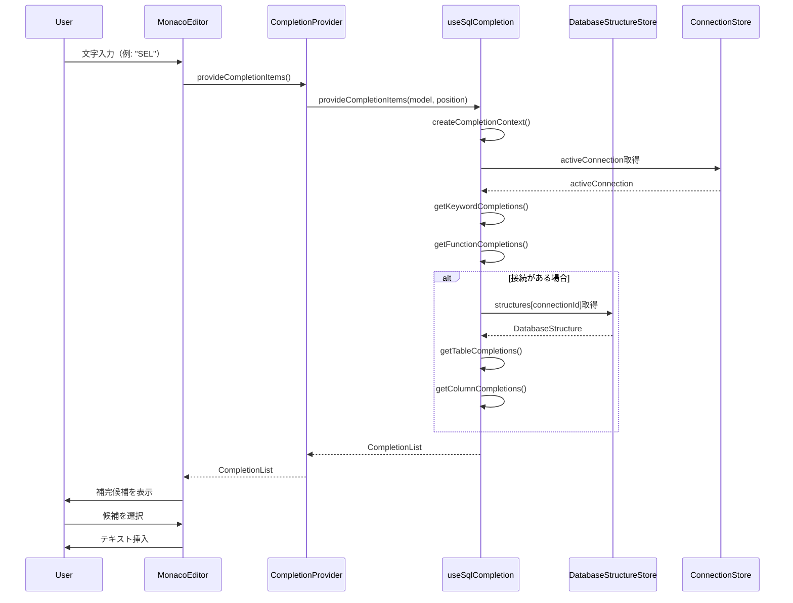
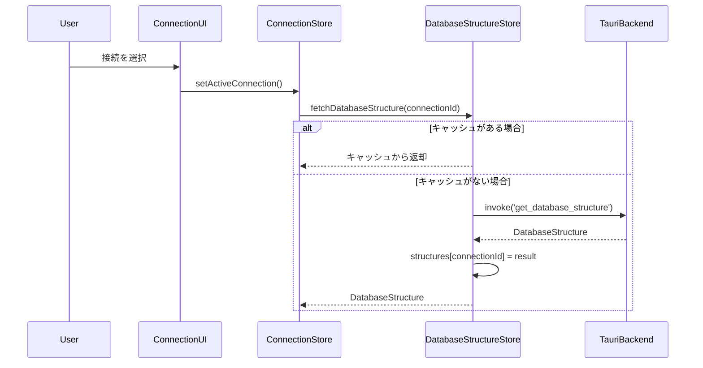

# 設計書：SQLエディタコードアシスト機能

## 1. アーキテクチャ概要

### 1.1 システム構成

```
┌─────────────────────────────────────────────────┐
│ SqlTextEditor.vue                               │
│ ┌─────────────────────────────────────────────┐ │
│ │ Monaco Editor                               │ │
│ │ ┌─────────────────────────────────────────┐ │ │
│ │ │ SQL Completion Provider (新規)         │ │ │
│ │ │ - registerCompletionItemProvider()    │ │ │
│ │ │ - provideCompletionItems()            │ │ │
│ │ └─────────────────────────────────────────┘ │ │
│ └─────────────────────────────────────────────┘ │
│                      ↓                          │
│ ┌─────────────────────────────────────────────┐ │
│ │ useSqlCompletion() (新規Composable)        │ │
│ │ - getKeywordCompletions()                  │ │
│ │ - getFunctionCompletions()                 │ │
│ │ - getTableCompletions()                    │ │
│ │ - getColumnCompletions()                   │ │
│ └─────────────────────────────────────────────┘ │
└─────────────────────────────────────────────────┘
                      ↓
┌─────────────────────────────────────────────────┐
│ 既存Store                                       │
│ - useDatabaseStructureStore() (スキーマ情報)   │
│ - useConnectionStore() (接続情報)              │
└─────────────────────────────────────────────────┘
```

### 1.2 レイヤー構造

| レイヤー | 責務 | ファイル |
|---------|------|---------|
| **Presentation** | Monaco Editorとの統合 | `SqlTextEditor.vue` |
| **Business Logic** | 補完候補の生成ロジック | `composables/useSqlCompletion.ts` |
| **Data** | SQL定義データ | `constants/sql-keywords.ts`, `data/function-catalog.ts`(既存) |
| **State** | スキーマキャッシュ（既存） | `stores/database-structure.ts` |

## 2. 詳細設計

### 2.1 新規ファイル構成

```
app/
├── components/sql-editor/
│   └── SqlTextEditor.vue                    (変更)
├── composables/
│   └── useSqlCompletion.ts                  (新規)
├── constants/
│   └── sql-keywords.ts                      (新規) ※キーワード定義のみ
├── data/
│   └── function-catalog.ts                  (既存活用) ※関数定義
└── types/
    └── sql-completion.ts                    (新規)
```

### 2.2 データ構造設計

#### 2.2.1 型定義 (`app/types/sql-completion.ts`)

```typescript
import type * as monaco from 'monaco-editor'

/**
 * SQL補完アイテムの種類
 */
export type SqlCompletionKind =
  | 'keyword'    // SQLキーワード
  | 'function'   // SQL関数
  | 'table'      // テーブル名
  | 'column'     // カラム名
  | 'schema'     // スキーマ名

/**
 * SQL補完アイテム
 */
export interface SqlCompletionItem {
  label: string                              // 表示名
  kind: SqlCompletionKind                    // 種類
  insertText: string                         // 挿入テキスト
  detail?: string                            // 詳細情報（型情報等）
  documentation?: string                     // ドキュメント（説明）
  sortText?: string                          // ソート順（優先度制御）
  filterText?: string                        // フィルタ用テキスト
}

/**
 * SQLキーワード定義
 */
export interface SqlKeyword {
  name: string                               // キーワード
  description?: string                       // 説明
  category: 'dml' | 'ddl' | 'clause' | 'operator' | 'other'
}

/**
 * 注意: SQL関数定義は既存の FunctionDefinition (app/data/function-catalog.ts) を使用
 */

/**
 * 補完コンテキスト
 */
export interface CompletionContext {
  connectionId: string | null                // 現在の接続ID
  databaseType: 'postgresql' | 'mysql' | 'sqlite' | null
  currentWord: string                        // 現在入力中の単語
  previousWord: string | null                // 直前の単語
  lineText: string                           // 現在行のテキスト
  position: monaco.Position                  // カーソル位置
}
```

#### 2.2.2 SQLキーワード定義 (`app/constants/sql-keywords.ts`)

```typescript
import type { SqlKeyword } from '~/types/sql-completion'

/**
 * SQLキーワード定義
 */
export const SQL_KEYWORDS: SqlKeyword[] = [
  // DML
  { name: 'SELECT', category: 'dml', description: 'データを取得' },
  { name: 'INSERT', category: 'dml', description: 'データを挿入' },
  { name: 'UPDATE', category: 'dml', description: 'データを更新' },
  { name: 'DELETE', category: 'dml', description: 'データを削除' },

  // DDL
  { name: 'CREATE', category: 'ddl', description: 'オブジェクトを作成' },
  { name: 'ALTER', category: 'ddl', description: 'オブジェクトを変更' },
  { name: 'DROP', category: 'ddl', description: 'オブジェクトを削除' },
  { name: 'TRUNCATE', category: 'ddl', description: 'テーブルを切り詰め' },

  // 句
  { name: 'FROM', category: 'clause', description: 'テーブルを指定' },
  { name: 'WHERE', category: 'clause', description: '条件を指定' },
  { name: 'GROUP BY', category: 'clause', description: 'グループ化' },
  { name: 'HAVING', category: 'clause', description: 'グループ化後の条件' },
  { name: 'ORDER BY', category: 'clause', description: '並び替え' },
  { name: 'LIMIT', category: 'clause', description: '取得件数を制限' },
  { name: 'OFFSET', category: 'clause', description: '開始位置を指定' },

  // JOIN
  { name: 'JOIN', category: 'clause', description: 'テーブルを結合' },
  { name: 'INNER JOIN', category: 'clause', description: '内部結合' },
  { name: 'LEFT JOIN', category: 'clause', description: '左外部結合' },
  { name: 'RIGHT JOIN', category: 'clause', description: '右外部結合' },
  { name: 'FULL JOIN', category: 'clause', description: '完全外部結合' },
  { name: 'CROSS JOIN', category: 'clause', description: '交差結合' },

  // 演算子・その他
  { name: 'AND', category: 'operator', description: '論理積' },
  { name: 'OR', category: 'operator', description: '論理和' },
  { name: 'NOT', category: 'operator', description: '否定' },
  { name: 'IN', category: 'operator', description: '値のリストに含まれる' },
  { name: 'BETWEEN', category: 'operator', description: '範囲指定' },
  { name: 'LIKE', category: 'operator', description: 'パターンマッチ' },
  { name: 'IS NULL', category: 'operator', description: 'NULL判定' },
  { name: 'IS NOT NULL', category: 'operator', description: '非NULL判定' },
  { name: 'EXISTS', category: 'operator', description: '存在チェック' },

  { name: 'AS', category: 'other', description: '別名定義' },
  { name: 'DISTINCT', category: 'other', description: '重複を除外' },
  { name: 'ALL', category: 'other', description: 'すべて' },
  { name: 'ASC', category: 'other', description: '昇順' },
  { name: 'DESC', category: 'other', description: '降順' },
  { name: 'CASE', category: 'other', description: '条件分岐' },
  { name: 'WHEN', category: 'other', description: 'CASE文の条件' },
  { name: 'THEN', category: 'other', description: 'CASE文の結果' },
  { name: 'ELSE', category: 'other', description: 'CASE文のデフォルト' },
  { name: 'END', category: 'other', description: 'CASE文の終了' },
]

/**
 * Monaco CompletionItemKindへのマッピング
 */
export const COMPLETION_KIND_MAP = {
  keyword: 14,    // monaco.languages.CompletionItemKind.Keyword
  function: 1,    // monaco.languages.CompletionItemKind.Function
  table: 19,      // monaco.languages.CompletionItemKind.Struct
  column: 10,     // monaco.languages.CompletionItemKind.Field
  schema: 8,      // monaco.languages.CompletionItemKind.Module
} as const
```

#### 2.2.3 SQL関数定義（既存ファイルを活用）

**ファイル**: `app/data/function-catalog.ts`（既存）

SQL関数の定義は既存の `function-catalog.ts` を活用します。このファイルには：

- **データベース種別ごとの関数カタログ**が実装済み
  - `COMMON_FUNCTIONS`: すべてのDBで共通の関数（15個）
  - `POSTGRESQL_FUNCTIONS`: PostgreSQL専用関数を含む
  - `MYSQL_FUNCTIONS`: MySQL専用関数を含む
  - `SQLITE_FUNCTIONS`: SQLite専用関数を含む

- **切り替え関数**も実装済み
  ```typescript
  getFunctionCatalog(dbType: 'postgresql' | 'mysql' | 'sqlite'): FunctionDefinition[]
  ```

- **既存の型定義**
  ```typescript
  interface FunctionDefinition {
    name: string                              // 関数名
    category: 'string' | 'date' | 'numeric' | 'conditional' | 'aggregate'
    description: string                       // 説明
    paramCount: number | 'variable'           // パラメータ数
    example: string                           // 使用例
    dbSpecificSyntax?: string                 // DB固有構文（オプション）
  }
  ```

**補完機能での使用方法**:
```typescript
import { getFunctionCatalog, type FunctionDefinition } from '~/data/function-catalog'

// データベースタイプに応じた関数を取得
const dbType = context.databaseType || 'postgresql'
const functions = getFunctionCatalog(dbType)

```

### 2.3 Composable設計 (`app/composables/useSqlCompletion.ts`)

```typescript
import type * as monaco from 'monaco-editor'
import type { CompletionContext, SqlCompletionItem } from '~/types/sql-completion'
import { SQL_KEYWORDS, COMPLETION_KIND_MAP } from '~/constants/sql-keywords'
import { getFunctionCatalog, type FunctionDefinition } from '~/data/function-catalog'

export function useSqlCompletion() {
  const databaseStructureStore = useDatabaseStructureStore()
  const connectionStore = useConnectionStore()

  /**
   * 補完候補を提供（Monaco Editorから呼ばれる）
   */
  function provideCompletionItems(
    model: monaco.editor.ITextModel,
    position: monaco.Position,
  ): monaco.languages.CompletionList {
    const context = createCompletionContext(model, position)
    const items: monaco.languages.CompletionItem[] = []

    // キーワード補完
    items.push(...getKeywordCompletions(context))

    // 関数補完
    items.push(...getFunctionCompletions(context))

    // テーブル名補完（接続がある場合）
    if (context.connectionId) {
      items.push(...getTableCompletions(context))
      items.push(...getColumnCompletions(context))
    }

    return {
      suggestions: items,
    }
  }

  /**
   * 補完コンテキストを作成
   */
  function createCompletionContext(
    model: monaco.editor.ITextModel,
    position: monaco.Position,
  ): CompletionContext {
    const lineText = model.getLineContent(position.lineNumber)
    const textUntilPosition = lineText.substring(0, position.column - 1)
    const words = textUntilPosition.trim().split(/\s+/)
    const currentWord = words[words.length - 1] || ''
    const previousWord = words.length > 1 ? words[words.length - 2] : null

    const activeConnection = connectionStore.activeConnection

    return {
      connectionId: activeConnection?.id || null,
      databaseType: activeConnection?.type || null,
      currentWord,
      previousWord: previousWord?.toUpperCase() || null,
      lineText,
      position,
    }
  }

  /**
   * SQLキーワードの補完候補を取得
   */
  function getKeywordCompletions(context: CompletionContext): monaco.languages.CompletionItem[] {
    return SQL_KEYWORDS
      .filter(keyword => keyword.name.startsWith(context.currentWord.toUpperCase()))
      .map(keyword => ({
        label: keyword.name,
        kind: COMPLETION_KIND_MAP.keyword,
        insertText: keyword.name,
        detail: keyword.description,
        sortText: `1_${keyword.name}`, // キーワードは優先度高
      }))
  }

  /**
   * SQL関数の補完候補を取得
   */
  function getFunctionCompletions(context: CompletionContext): monaco.languages.CompletionItem[] {
    // データベースタイプに応じた関数カタログを取得（既存のfunction-catalog.tsを活用）
    const dbType = context.databaseType || 'postgresql'
    const functions = getFunctionCatalog(dbType)

    return functions
      .filter(func => {
        // 入力中の文字でフィルタ
        return func.name.toUpperCase().startsWith(context.currentWord.toUpperCase())
      })
      .map(func => {
        // パラメータ数に応じて挿入テキストを生成
        const insertText = func.paramCount === 0
          ? `${func.name}()` // パラメータなし
          : `${func.name}($0)` // $0はカーソル位置（スニペット構文）

        return {
          label: func.name,
          kind: COMPLETION_KIND_MAP.function,
          insertText,
          insertTextRules: 4, // monaco.languages.CompletionItemInsertTextRule.InsertAsSnippet
          detail: `${func.category} - ${func.description}`,
          documentation: func.example, // 既存のexampleフィールドを使用
          sortText: `2_${func.name}`, // 関数は中優先度
        }
      })
  }

  /**
   * テーブル名の補完候補を取得
   */
  function getTableCompletions(context: CompletionContext): monaco.languages.CompletionItem[] {
    if (!context.connectionId) return []

    const structure = databaseStructureStore.structures[context.connectionId]
    if (!structure) return []

    const items: monaco.languages.CompletionItem[] = []

    for (const schema of structure.schemas) {
      for (const table of schema.tables) {
        const fullName = schema.name === 'public' ? table.name : `${schema.name}.${table.name}`

        // スキーマ名込みでフィルタ
        if (!fullName.toLowerCase().startsWith(context.currentWord.toLowerCase())) {
          continue
        }

        items.push({
          label: fullName,
          kind: COMPLETION_KIND_MAP.table,
          insertText: fullName,
          detail: table.comment || `Table (${table.estimatedRowCount || 0} rows)`,
          documentation: table.comment,
          sortText: schema.isSystem
            ? `4_${fullName}` // システムテーブルは優先度低
            : `3_${fullName}`, // ユーザーテーブルは中優先度
        })
      }
    }

    return items
  }

  /**
   * カラム名の補完候補を取得
   */
  function getColumnCompletions(context: CompletionContext): monaco.languages.CompletionItem[] {
    if (!context.connectionId) return []

    const structure = databaseStructureStore.structures[context.connectionId]
    if (!structure) return []

    const items: monaco.languages.CompletionItem[] = []

    // すべてのテーブルのカラムを候補に追加
    // TODO: 将来的にはコンテキスト（FROM句のテーブル等）を解析して絞り込み
    for (const schema of structure.schemas) {
      for (const table of schema.tables) {
        for (const column of table.columns) {
          // 入力中の文字でフィルタ
          if (!column.name.toLowerCase().startsWith(context.currentWord.toLowerCase())) {
            continue
          }

          // 制約情報の表示
          const constraints: string[] = []
          if (column.isPrimaryKey) constraints.push('PK')
          if (column.isForeignKey) constraints.push('FK')
          if (column.isUnique) constraints.push('UNIQUE')
          if (column.isAutoIncrement) constraints.push('AUTO')

          const constraintStr = constraints.length > 0 ? `, ${constraints.join(', ')}` : ''
          const detail = `${column.displayType}${constraintStr}`
          const documentation = [
            `**Table**: ${schema.name}.${table.name}`,
            `**Type**: ${column.displayType}`,
            `**Nullable**: ${column.nullable ? 'YES' : 'NO'}`,
            column.defaultValue ? `**Default**: ${column.defaultValue}` : null,
            column.comment ? `**Comment**: ${column.comment}` : null,
          ].filter(Boolean).join('\n')

          items.push({
            label: `${column.name} (${table.name})`,
            kind: COMPLETION_KIND_MAP.column,
            insertText: column.name,
            detail,
            documentation,
            sortText: column.isPrimaryKey
              ? `3_${column.name}` // PKは優先度高
              : `4_${column.name}`,
          })
        }
      }
    }

    return items
  }

  return {
    provideCompletionItems,
  }
}
```

### 2.4 コンポーネント変更 (`app/components/sql-editor/SqlTextEditor.vue`)

既存の`SqlTextEditor.vue`に以下の変更を加える：

```typescript
// <script setup>内に追加

import { useSqlCompletion } from '~/composables/useSqlCompletion'

const { provideCompletionItems } = useSqlCompletion()

// onMountedフック内、エディタ作成後に追加
onMounted(async () => {
  // ... 既存のエディタ作成コード ...

  // 補完プロバイダーの登録
  const disposable = monaco.languages.registerCompletionItemProvider('sql', {
    provideCompletionItems: (model, position) => {
      return provideCompletionItems(model, position)
    },
    triggerCharacters: ['.', ' '], // トリガー文字（テーブル名後のドット、スペース）
  })

  // クリーンアップ時に登録解除
  onBeforeUnmount(() => {
    disposable.dispose()
  })
})
```

## 3. 処理フロー

### 3.1 補完候補表示フロー



### 3.2 スキーマ情報取得フロー（既存機構）



## 4. エラーハンドリング

### 4.1 エラーケースと対処

| エラーケース | 対処方法 |
|------------|---------|
| 接続情報がない | キーワードと関数のみ補完 |
| スキーマ情報取得失敗 | エラーログ出力、キーワードと関数のみ補完 |
| スキーマ情報が大規模（1000テーブル以上） | フィルタリングを厳格化、先頭マッチのみ |
| Monaco Editorの初期化失敗 | 補完機能なしでエディタは動作 |

### 4.2 パフォーマンス対策

- **遅延ロード**: スキーマ情報は必要時のみ取得（既存機構）
- **メモ化**: 補完候補リストの生成結果をキャッシュ（将来対応）
- **フィルタリング最適化**: 前方一致のみ、大文字小文字を区別しない
- **候補数制限**: 1カテゴリあたり最大100件に制限

## 5. テストコード設計

### 5.1 ユニットテスト

#### 5.1.1 `useSqlCompletion.test.ts`

```typescript
import { describe, it, expect, beforeEach } from 'vitest'
import { setActivePinia, createPinia } from 'pinia'
import { useSqlCompletion } from '~/composables/useSqlCompletion'
import type { CompletionContext } from '~/types/sql-completion'

describe('useSqlCompletion', () => {
  beforeEach(() => {
    setActivePinia(createPinia())
  })

  describe('getKeywordCompletions', () => {
    it('入力文字で始まるキーワードを返す', () => {
      const { provideCompletionItems } = useSqlCompletion()
      const context: CompletionContext = {
        connectionId: null,
        databaseType: null,
        currentWord: 'SEL',
        previousWord: null,
        lineText: 'SEL',
        position: { lineNumber: 1, column: 4 } as any,
      }

      const result = provideCompletionItems(createMockModel('SEL'), createMockPosition(1, 4))
      const labels = result.suggestions.map(s => s.label)

      expect(labels).toContain('SELECT')
      expect(labels).not.toContain('INSERT')
    })

    it('大文字小文字を区別しない', () => {
      // ... テストコード
    })
  })

  describe('getFunctionCompletions', () => {
    it('入力文字で始まる関数を返す', () => {
      // ... テストコード
    })

    it('DBMS種別に応じた関数カタログを使用する', () => {
      const context: CompletionContext = {
        connectionId: 'test-id',
        databaseType: 'postgresql',
        currentWord: 'array',
        previousWord: null,
        lineText: 'SELECT array',
        position: { lineNumber: 1, column: 13 } as any,
      }

      // getFunctionCatalog('postgresql')が呼ばれることを確認
      // PostgreSQL固有のarray_aggが候補に含まれることを確認

      // MySQL接続の場合
      context.databaseType = 'mysql'
      // getFunctionCatalog('mysql')が呼ばれることを確認
      // MySQL固有のGROUP_CONCATが候補に含まれることを確認
    })
  })

  describe('getTableCompletions', () => {
    it('接続IDがない場合は空配列を返す', () => {
      // ... テストコード
    })

    it('スキーマ情報からテーブル名を返す', () => {
      // ... テストコード（モックスキーマデータを使用）
    })

    it('システムテーブルの優先度を下げる', () => {
      // ... テストコード
    })
  })

  describe('getColumnCompletions', () => {
    it('すべてのテーブルのカラムを返す', () => {
      // ... テストコード
    })

    it('PRIMARY KEYの優先度を上げる', () => {
      // ... テストコード
    })

    it('カラムの詳細情報を含める', () => {
      // ... テストコード（型、制約、コメント等）
    })
  })
})

// モックヘルパー関数
function createMockModel(content: string): any {
  return {
    getLineContent: (lineNumber: number) => content,
  }
}

function createMockPosition(lineNumber: number, column: number): any {
  return { lineNumber, column }
}
```

### 5.2 統合テスト

#### 5.2.1 `SqlTextEditor.integration.test.ts`

```typescript
import { describe, it, expect, beforeEach } from 'vitest'
import { mount } from '@vue/test-utils'
import SqlTextEditor from '~/components/sql-editor/SqlTextEditor.vue'

describe('SqlTextEditor - 補完統合テスト', () => {
  it('Monaco Editorに補完プロバイダーが登録される', async () => {
    const wrapper = mount(SqlTextEditor, {
      props: {
        // ... 必要なprops
      },
    })

    await wrapper.vm.$nextTick()

    // Monaco Editorのインスタンスが作成されていることを確認
    // 補完プロバイダーが登録されていることを確認
  })

  it('コンポーネント破棄時に補完プロバイダーが解除される', async () => {
    const wrapper = mount(SqlTextEditor)
    await wrapper.vm.$nextTick()

    wrapper.unmount()

    // disposeが呼ばれていることを確認
  })
})
```

## 6. 将来拡張

### 6.1 コンテキスト解析の高度化

現在はすべてのテーブル・カラムを候補に含めるが、将来的には：

- FROM句に記載されたテーブルのカラムのみ表示
- JOIN条件でのカラム推論
- サブクエリ内部のスコープ解析

### 6.2 カスタムスニペット

ユーザー定義のSQLテンプレートを登録可能にする：

```typescript
interface SqlSnippet {
  prefix: string       // トリガー文字列
  body: string[]       // 挿入テキスト（複数行対応）
  description: string  // 説明
}
```

### 6.3 クエリ履歴からの補完

過去に実行したクエリのテーブル名・カラム名を優先的に表示。

## 7. 関連ドキュメント

- [要件定義書](./requirements.md)
- [タスクリスト](./tasklist.md)
- [テスト手順書](./testing.md)
